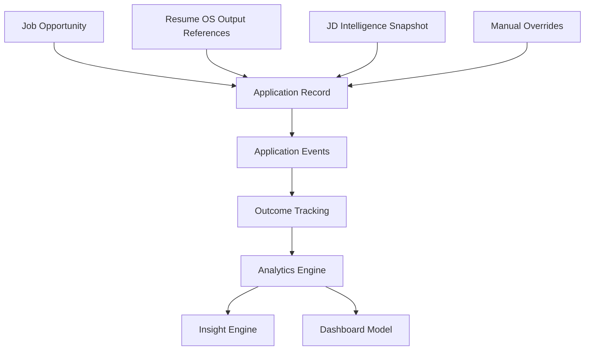

# Application Intelligence Architecture

Last updated: 2026-07-17

## Mission

Application Intelligence records job applications, the exact Resume OS configuration used, manual overrides, outcomes, and hiring funnel progression. It exists to answer whether Resume OS improves qualified interview rates.

## System Boundary

Application Intelligence does not generate resumes, rewrite Resume OS artifacts, scrape jobs, submit applications, or predict hiring outcomes. It records what happened and produces deterministic analytics from recorded data.

## Architecture

## Standard Lifecycle States

- Discovered
- Saved
- Resume Generated
- Human Reviewed
- Applied
- Recruiter Viewed
- Recruiter Contact
- Recruiter Reject
- Online Assessment
- Hiring Manager Interview
- Product Interview
- System Design
- Final Round
- Offer
- Rejected
- Withdrawn
- Accepted

Future states are allowed when explicitly configured and mapped into the funnel model.

## Success Criteria

- Every application is traceable.
- Every outcome is measurable.
- Every insight is data-backed.
- Resume content is referenced, not duplicated.
- The model can support future Interview OS and Recommendation Engine work.

