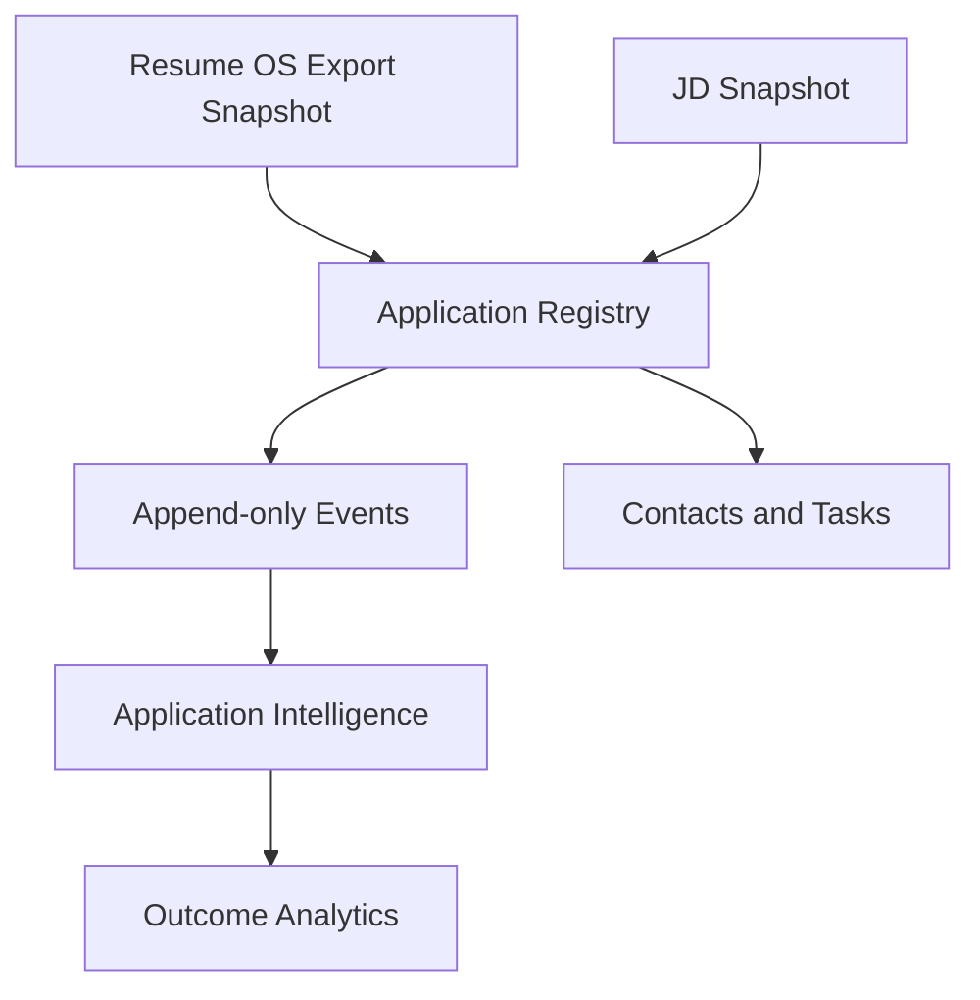

# Application Registry Architecture

Last updated: 2026-07-18

## Mission

Application Registry is the private, local-first system of record for real job applications. It owns operational state, lifecycle history, contacts, tasks, notes, and links to Resume OS artifacts.

## Boundary

- Application Registry owns operational records.
- Application Intelligence reads registry records and calculates metrics.
- Resume OS produces resume artifacts and does not own application lifecycle state.

## Readiness Principle

The registry is safe to use only when private data remains ignored by Git, every material change creates an event, and validation passes with no P0 privacy or integrity failures.

