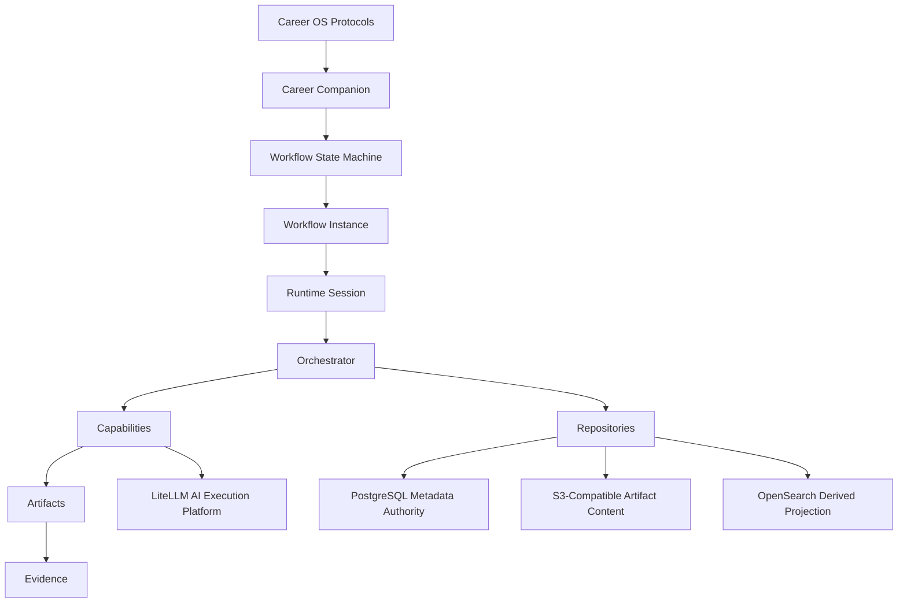
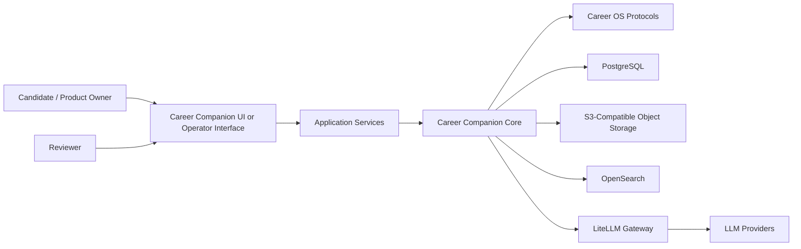
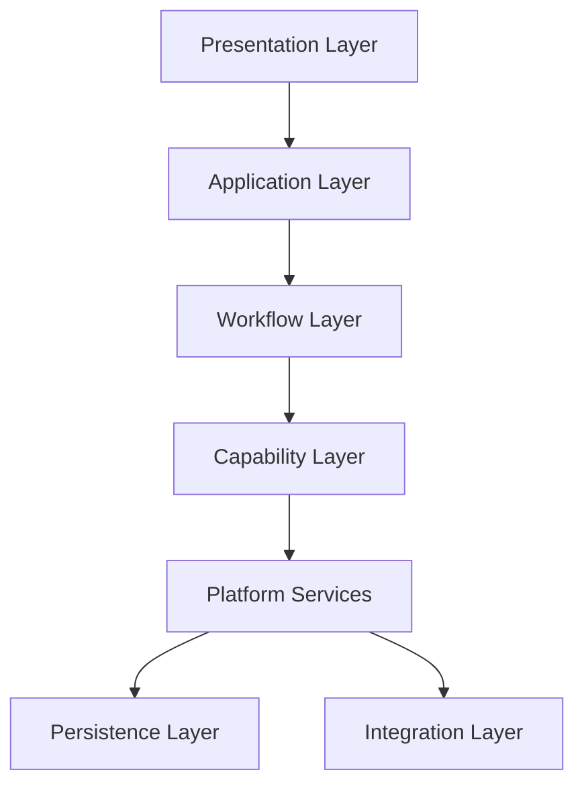
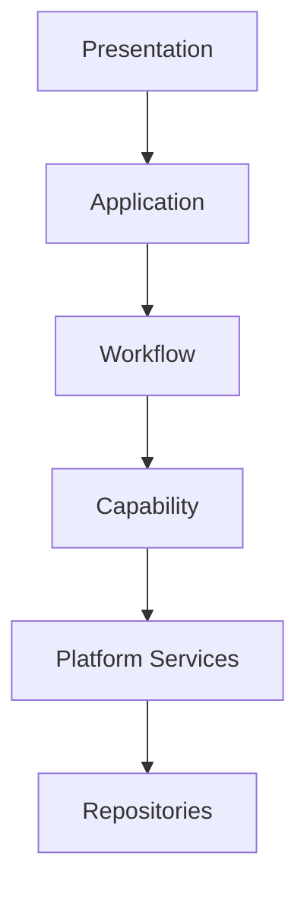
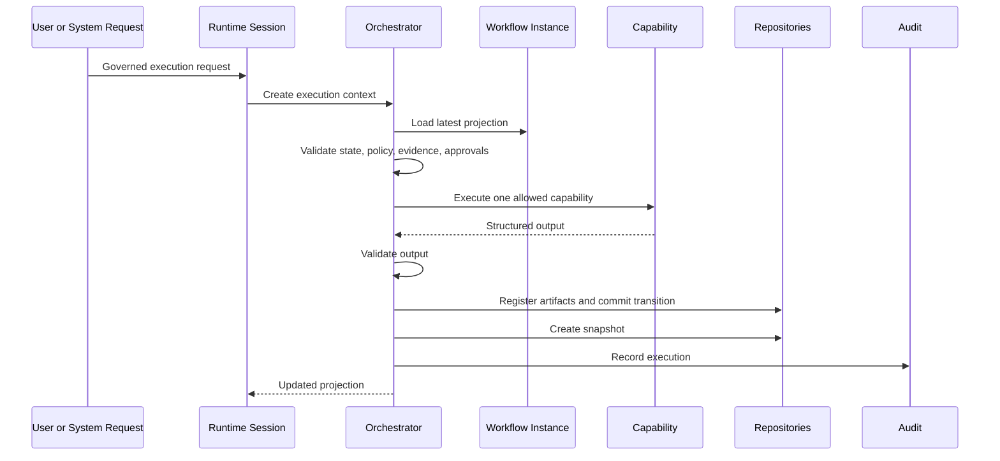
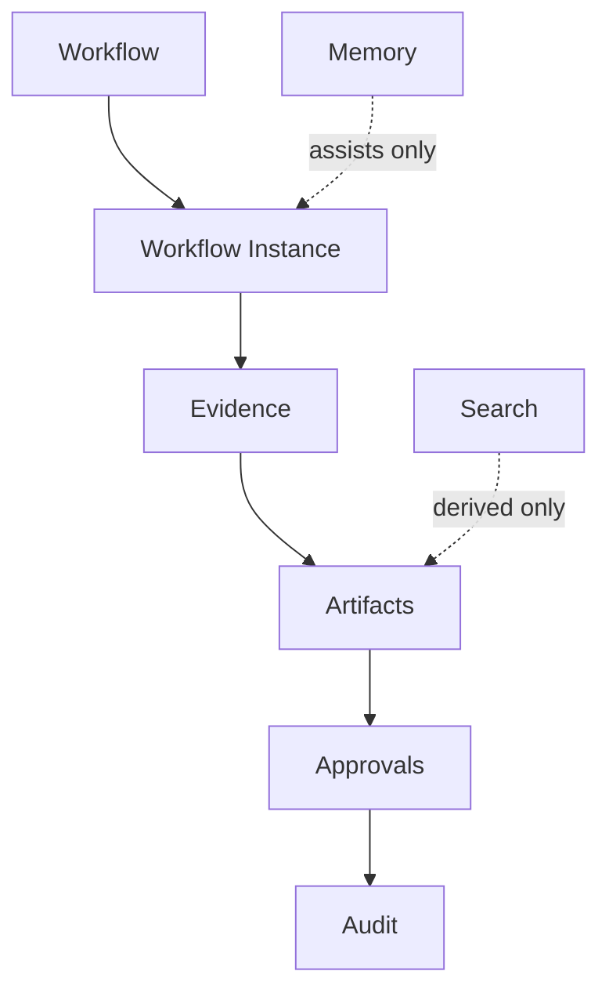
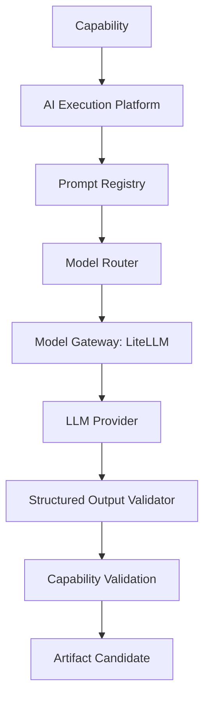
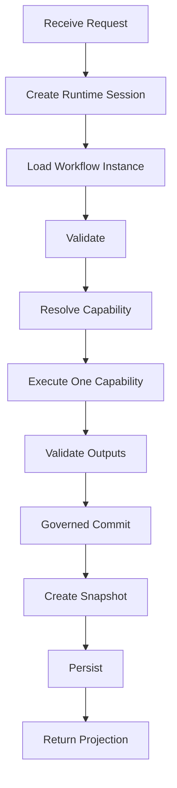
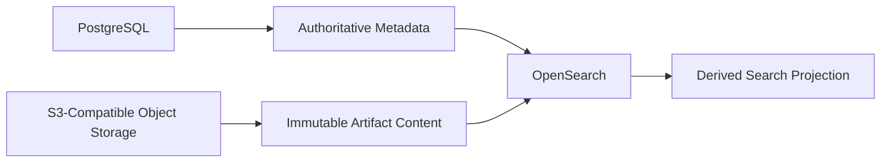
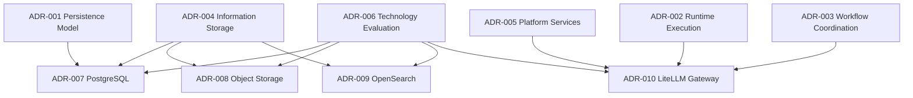

# Career Companion Architecture Blueprint v1.0

## 1. Executive Summary

Career Companion is a governed AI career operating platform built on top of Career OS. Career OS remains the operational protocol. Career Companion consumes that protocol through explicit workflow state, capability contracts, artifact governance, evidence authority, runtime coordination, persistence boundaries, platform services, and ADR-governed technology choices.

This blueprint is the primary architecture entry point for implementation. It consolidates the approved architecture without replacing the source documents or duplicating ADR content.

Implementation must conform to:

- [Product Charter](../product-charter.md)
- [Workflow State Machine](../workflow-state-machine.md)
- [Capability Contracts](../capability-contracts.md)
- [Artifact Model](../artifact-model.md)
- [Workflow Instance](../workflow-instance.md)
- [Orchestrator Architecture](../orchestrator-architecture.md)
- [Capability Architecture](../capability-architecture.md)
- [Memory & Evidence Architecture](../memory-evidence-architecture.md)
- [Persistence Architecture](../persistence-architecture.md)
- [Runtime Architecture](../runtime-architecture.md)
- [Reference Architecture](../reference-architecture.md)
- [Solution Architecture](../solution-architecture.md)
- [Component Architecture](../component-architecture.md)
- [Interaction Architecture](../interaction-architecture.md)
- [Architecture Principles](../architecture-principles.md)
- [ADR Index](../adr/index.md)

## 2. Architecture Vision

Career Companion is not a free-form AI assistant. It is a deterministic, governed workflow platform that uses AI only through approved capability boundaries.

The architecture vision:

- Career OS defines operational protocol.
- Workflow state defines what may happen.
- Workflow Instance records what has happened.
- Runtime executes one governed cycle at a time.
- Orchestrator coordinates execution without owning business logic.
- Capabilities transform approved inputs into approved outputs.
- Evidence authorizes decisions.
- Artifacts carry business information.
- PostgreSQL stores authoritative transactional metadata.
- S3-compatible object storage stores immutable artifact content.
- OpenSearch stores derived search projections.
- LiteLLM provides the approved AI execution gateway.
- ADRs govern every material architecture and technology decision.

## 3. Architecture Principles

The architecture is governed by [Architecture Principles](../architecture-principles.md). The most important implementation rules are:

- Career OS governs Career Companion.
- Workflow governs execution.
- Human approval cannot be bypassed.
- Evidence is authoritative.
- Memory is advisory.
- Approved artifacts are immutable.
- Workflow Instances are durable.
- Runtime Sessions are ephemeral.
- Orchestrator coordinates but does not own state.
- Capabilities never control workflow.
- Repositories are the only persistence boundary.
- Search is derived.
- AI execution must pass through the approved AI Execution Platform.
- Recovery appends history.
- Audit is mandatory for consequential execution.

Any implementation that violates these principles is architecturally invalid, even if it works technically.

## 4. System Context

Career Companion operates inside the Career OS ecosystem.

Boundary rules:

- Users and reviewers make consequential decisions.
- Career Companion coordinates governed execution.
- External LLM providers are hidden behind LiteLLM.
- Search is derived from authoritative stores.
- PostgreSQL and object storage remain authoritative for their assigned information classes.

## 5. Logical Architecture

The logical solution is layered as defined in [Solution Architecture](../solution-architecture.md):

Layer responsibilities:

- Presentation: display projections, collect intent, surface approvals.
- Application: translate user intent into governed execution requests.
- Workflow: evaluate legal states, transitions, gates, and invariants.
- Capability: execute bounded business transformations.
- Platform Services: provide identity, authorization, policy, audit, search, model gateway, rendering, configuration, observability, and registries.
- Persistence: preserve authoritative business records and derived projections.
- Integration: isolate external systems behind governed boundaries.

## 6. Component Architecture

The component model is defined in [Component Architecture](../component-architecture.md). Components implement architecture and never redefine it.

Core components:

- UI
- Request Mapper
- Application Service
- Command Coordinator
- Workflow Resolver
- Transition Evaluator
- Gate Evaluator
- Approval Evaluator
- Workflow Validator
- Orchestrator
- Capability Registry
- Capability Resolver
- Capability Executor
- Capability Adapter
- Capability Validator
- Repositories
- Recovery Coordinator
- Validation Engine
- Policy Engine
- Model Gateway
- Audit
- Search
- Document Renderer
- Observability

Dependency direction:

Forbidden paths:

- UI directly mutating workflow state.
- Capabilities directly persisting records.
- Capabilities calling other capabilities.
- Platform services owning business workflow progression.
- Search acting as authority.
- AI providers being called directly by capabilities.

## 7. Workflow Architecture

Workflow execution is governed by [Workflow State Machine](../workflow-state-machine.md), [Workflow Instance](../workflow-instance.md), [Runtime Architecture](../runtime-architecture.md), and ADR-002 / ADR-003.

Workflow states are explicit. Every application workflow has a Workflow Instance that records:

- Current state.
- Previous state.
- Current gate.
- Instance status.
- Artifact references.
- Approval references.
- Capability execution references.
- Transitions.
- Snapshots.
- Audit references.
- Current projection.

Canonical execution:

One governed execution cycle executes at most one capability.

## 8. Information Architecture

Information architecture is governed by [Artifact Model](../artifact-model.md), [Memory & Evidence Architecture](../memory-evidence-architecture.md), [Persistence Architecture](../persistence-architecture.md), ADR-001, ADR-004, ADR-007, ADR-008, and ADR-009.

Authority model:

Information classes:

- Transactional Business State: authoritative in PostgreSQL.
- Immutable Business Artifacts: content in S3-compatible object storage, metadata in PostgreSQL.
- Evidence: authoritative metadata in PostgreSQL.
- Audit: append-oriented metadata in PostgreSQL.
- Search: derived in OpenSearch.
- Cache: disposable, not selected in v1 blueprint.
- Advisory Memory: advisory, future technology decision.
- Configuration: authoritative metadata in PostgreSQL.

## 9. AI Architecture

AI execution is governed by [Capability Contracts](../capability-contracts.md), [Capability Architecture](../capability-architecture.md), [Component Architecture](../component-architecture.md), ADR-005, ADR-006, and ADR-010.

LiteLLM is the approved AI Execution Platform and Model Gateway. Capabilities never call LLM providers directly.

AI execution flow:

AI governance rules:

- Prompt templates are governed assets.
- Prompt versions are immutable after approval.
- Model routing is policy-governed.
- Every AI response is schema validated.
- AI output is not authoritative until capability validation accepts it.
- Every AI execution creates an immutable AI Execution Record.
- Search remains derived.
- PostgreSQL and immutable artifact storage remain authoritative.

## 10. Runtime Architecture

Runtime behavior is defined by [Runtime Architecture](../runtime-architecture.md), ADR-002, and ADR-003.

Runtime components:

- Request Entry.
- Runtime Session.
- Orchestrator.
- Capability Adapter.
- Validators.
- Repositories.
- Recovery Coordinator.
- Observability.

Runtime lifecycle:

Failure behavior:

- Missing evidence stops execution.
- Missing approval creates waiting state.
- Validation failure prevents commit.
- Timeout records failure.
- Cancellation is explicit.
- Recovery resumes from the latest governed commit.

## 11. Storage Architecture

Storage architecture follows ADR-001, ADR-004, ADR-007, ADR-008, and ADR-009.

Technology stack:

- PostgreSQL: authoritative transactional business state and metadata.
- S3-compatible Object Storage: immutable artifact content.
- OpenSearch: derived search and retrieval.
- LiteLLM: AI execution platform and model gateway.

Storage rules:

- PostgreSQL is the system of record for workflow and metadata.
- Object storage is not metadata authority.
- OpenSearch is not authority.
- Artifact content is immutable after registration.
- Approved artifact changes require new versions.
- Search indexes can be deleted and rebuilt.
- AI execution records are persisted as metadata.

## 12. Security Boundaries

Security boundaries are architectural, even before implementation-specific security decisions.

Boundary requirements:

- Identity identifies actors.
- Authentication establishes actor authenticity.
- Authorization controls access and actions.
- Secrets remain behind platform-service boundaries.
- Capabilities cannot access provider credentials.
- Capabilities cannot bypass Model Gateway.
- Search queries must enforce authorization-relevant filters.
- Artifact storage keys must avoid sensitive human-readable data.
- AI prompts must follow data minimization policy.
- Audit records must capture consequential actions.

High-risk boundaries:

- Human approval gates.
- Provider-facing AI execution.
- Artifact content access.
- Search indexing of sensitive text.
- Evidence and audit retrieval.
- Workflow transition commit.

## 13. Technology Stack

Accepted technology decisions:

| Concern | Decision | ADR |
| --- | --- | --- |
| Authoritative transactional store | PostgreSQL | [ADR-007](../adr/ADR-007-authoritative-transactional-store-technology.md) |
| Immutable artifact content | S3-compatible Object Storage | [ADR-008](../adr/ADR-008-immutable-artifact-storage-technology.md) |
| Derived search and retrieval | OpenSearch | [ADR-009](../adr/ADR-009-derived-search-and-retrieval-platform.md) |
| AI execution gateway | LiteLLM | [ADR-010](../adr/ADR-010-ai-execution-platform-and-model-gateway-strategy.md) |

Technology decisions not yet made:

- Cache.
- Advisory memory storage.
- Analytics.
- Identity provider.
- Deployment platform.
- Observability backend.
- Secrets provider.
- Scheduling implementation.
- Notification implementation.

## 14. ADR Dependency Map

ADR roles:

- ADR-001 through ADR-005 define implementation-governing architecture strategy.
- ADR-006 defines how technology decisions are evaluated.
- ADR-007 through ADR-010 select initial implementation technologies.

## 15. Implementation Readiness

Career Companion is ready for implementation planning when the following are true:

- Repository contracts are derived from ADR-001.
- PostgreSQL schema design follows aggregate ownership from ADR-007.
- Artifact metadata/content split follows ADR-008.
- Search projection pipeline follows ADR-009.
- AI execution boundary follows ADR-010.
- Runtime executes one capability per governed cycle.
- Prompt Registry and AI Execution Record contracts are defined before AI capability implementation.
- Validation tests cover architecture invariants.
- Security and privacy checks exist for artifact, search, and AI boundaries.

Recommended implementation order:

1. Define core contracts and validation suite.
2. Implement PostgreSQL-backed repositories.
3. Implement immutable artifact storage adapter.
4. Implement Runtime Session and Orchestrator shell.
5. Implement capability registry and capability execution boundary.
6. Implement LiteLLM-backed Model Gateway.
7. Implement Prompt Registry and AI Execution Record persistence.
8. Implement derived search projection pipeline.
9. Implement first manual-assisted capability.
10. Add operational validation and audit review.

## 16. Future Roadmap

Near-term architecture work:

- ADR for cache technology, if needed.
- ADR for advisory memory technology.
- ADR for identity and authorization implementation.
- ADR for observability backend.
- ADR for deployment architecture.
- Prompt Registry specification.
- AI Execution Record specification.
- Search index schema specification.
- PostgreSQL aggregate schema specification.
- Artifact storage retention policy.

Implementation roadmap:

- MVP should begin with governed single-user workflow execution.
- AI capabilities should be introduced one at a time.
- No capability should bypass AI Execution Platform.
- No search result should be used without authoritative rehydration.
- No artifact should be approved without metadata, content hash, version, and evidence references.
- No workflow transition should occur without validation, policy check, and audit.

The blueprint is stable for v1 implementation planning. Future changes require ADR review.
