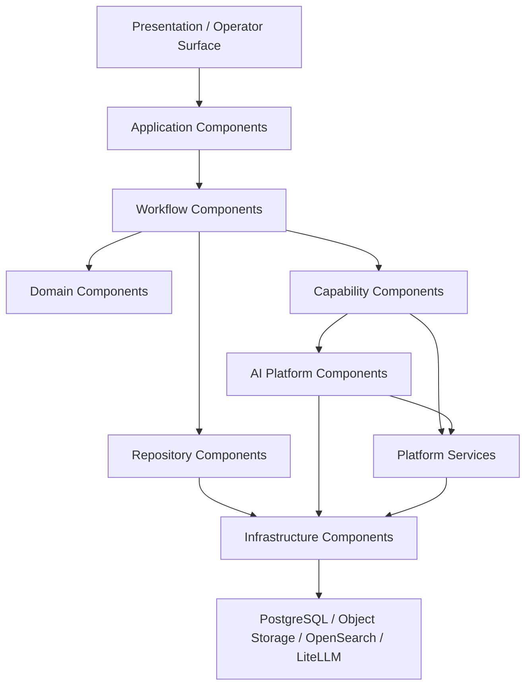

# Career Companion Component Specification

## 1. Executive Summary

This specification defines implementation-ready software components for Career Companion. It translates the approved architecture into component responsibilities, dependencies, public contracts, interaction patterns, failure boundaries, and observability responsibilities.

The specification is derived from:

- [Architecture Blueprint v1.0](../architecture/architecture-blueprint-v1.md)
- [Implementation Roadmap](implementation-roadmap.md)
- [Domain Model](domain-model.md)
- [Repository Specification](repository-specification.md)
- ADR-001 through ADR-010

This document does not define source code, class diagrams, database schema, or implementation frameworks. It is intended to guide module and package design for senior backend engineers.

## 2. Component Design Principles

- Components implement architecture; they do not redefine it.
- Components have one primary responsibility.
- Application components coordinate use cases.
- Domain components preserve invariants.
- Infrastructure components implement external boundaries.
- Platform services provide shared concerns.
- Repositories are persistence boundaries.
- Capabilities never call repositories directly.
- Capabilities never call LLM providers directly.
- Search is derived and never authoritative.
- Component dependencies must remain acyclic.
- Components communicate through explicit contracts and references.
- Failure boundaries must be visible and recoverable.
- Consequential actions must emit audit and observability records.

Layering rule:

```text
Presentation / Operator Surface
    ↓
Application Components
    ↓
Workflow Components
    ↓
Capability Components
    ↓
Platform Services
    ↓
Infrastructure Components
```

Infrastructure components must not depend on application or workflow components.

## 3. Component Catalogue

### Application Components

#### Application Service

Purpose:

Entry point for application-level use cases.

Responsibilities:

- Accept governed user or system requests.
- Invoke request validation.
- Coordinate workflow execution.
- Return updated projections and next actions.

Dependencies:

- Request Validator.
- Command Coordinator.
- Authorization Service.
- Workflow Runtime.
- Response Builder.

Public contracts:

- Submit governed request.
- Retrieve current projection.
- Retrieve required next action.

Failure boundary:

- Invalid request.
- Unauthorized actor.
- Workflow execution failure.

Observability:

- Request received.
- Request accepted or rejected.
- Workflow execution correlation ID.
- Response outcome.

#### Command Coordinator

Purpose:

Translate application requests into workflow execution commands.

Responsibilities:

- Resolve command intent.
- Attach actor and correlation context.
- Route command to Workflow Runtime.
- Preserve one-command-to-one-runtime-cycle semantics.

Dependencies:

- Request Validator.
- Workflow Runtime.
- Policy Service.

Public contracts:

- Create workflow execution command.
- Return command validation result.

Failure boundary:

- Unsupported command.
- Missing workflow reference.
- Policy denial.

Observability:

- Command type.
- Correlation ID.
- Policy result.

#### Request Validator

Purpose:

Validate request shape before workflow execution.

Responsibilities:

- Verify required fields.
- Verify actor context.
- Verify workflow reference format.
- Verify command compatibility.

Dependencies:

- Configuration Service.
- Authorization Service.

Public contracts:

- Validate request.

Failure boundary:

- Missing fields.
- Invalid identifiers.
- Unauthorized request shape.

Observability:

- Validation result.
- Validation failure category.

#### Response Builder

Purpose:

Build user-facing response envelopes from execution results.

Responsibilities:

- Convert projection into response shape.
- Attach warnings and next actions.
- Preserve references to authoritative records.

Dependencies:

- Projection Service.
- Authorization Service.

Public contracts:

- Build response from execution result.

Failure boundary:

- Missing projection.
- Unauthorized reference.

Observability:

- Response type.
- Warning count.

### Workflow Components

#### Workflow Runtime

Purpose:

Coordinate one governed workflow execution cycle.

Responsibilities:

- Create Runtime Session.
- Load Workflow Instance projection.
- Invoke Orchestrator.
- Return execution result.

Dependencies:

- Runtime Session Factory.
- Orchestrator.
- Observability Service.

Public contracts:

- Execute governed workflow command.

Failure boundary:

- Runtime session creation failure.
- Timeout.
- Cancellation.

Observability:

- Runtime Session ID.
- Execution duration.
- Outcome.
- Failure category.

#### Orchestrator

Purpose:

Coordinate one governed execution cycle.

Responsibilities:

- Validate workflow context.
- Resolve allowed capability.
- Execute one capability.
- Validate output.
- Coordinate repository commit.
- Create snapshot.
- Record audit.
- Return projection.

Dependencies:

- Workflow Resolver.
- Validation Engine.
- Capability Resolver.
- Capability Executor.
- Repository Unit Coordinator.
- Snapshot Service.
- Audit Service.
- Projection Service.

Public contracts:

- Execute one governed cycle.

Failure boundary:

- Invalid state.
- Missing approval.
- Capability failure.
- Commit failure.
- Recovery required.

Observability:

- Execution ID.
- Capability ID.
- Transition result.
- Snapshot ID.
- Audit Record ID.

#### Workflow Resolver

Purpose:

Resolve workflow definition and current state contract.

Responsibilities:

- Load workflow definition metadata.
- Resolve current state.
- Return allowed actions and gates.

Dependencies:

- Workflow Repository.
- Configuration Service.

Public contracts:

- Resolve workflow context.

Failure boundary:

- Missing workflow definition.
- Unknown state.

Observability:

- Workflow definition version.
- Current state.

#### Transition Evaluator

Purpose:

Evaluate legal state transitions.

Responsibilities:

- Validate from-state and to-state.
- Verify gate outcome.
- Verify transition preconditions.

Dependencies:

- Workflow Resolver.
- Gate Evaluator.
- Policy Service.

Public contracts:

- Evaluate transition.

Failure boundary:

- Invalid transition.
- Unsatisfied precondition.

Observability:

- From-state.
- To-state.
- Evaluation result.

#### Gate Evaluator

Purpose:

Evaluate approval gate requirements.

Responsibilities:

- Identify required evidence.
- Validate approval references.
- Return pass, fail, or waiting result.

Dependencies:

- Approval Evaluator.
- Evidence Repository.
- Policy Service.

Public contracts:

- Evaluate gate.

Failure boundary:

- Missing approval.
- Invalid approval.
- Missing evidence.

Observability:

- Gate ID.
- Gate result.
- Required evidence count.

#### Recovery Coordinator

Purpose:

Coordinate recovery after failed or interrupted execution.

Responsibilities:

- Load latest valid projection.
- Resolve latest snapshot.
- Determine retry, resume, block, or cancel route.
- Preserve failed attempt history.

Dependencies:

- Workflow Repository.
- Snapshot Repository.
- Audit Repository.
- Policy Service.

Public contracts:

- Determine recovery action.

Failure boundary:

- Missing snapshot.
- Conflicting history.
- Unrecoverable state.

Observability:

- Recovery action.
- Failure category.
- Snapshot reference.

### Domain Components

#### Domain Validator

Purpose:

Validate aggregate invariants.

Responsibilities:

- Validate Workflow Instance invariants.
- Validate Artifact invariants.
- Validate Evidence invariants.
- Validate Snapshot and Audit invariants.

Dependencies:

- Domain Model contracts.

Public contracts:

- Validate aggregate.
- Validate aggregate transition.

Failure boundary:

- Invariant violation.

Observability:

- Aggregate type.
- Validation result.

#### Projection Service

Purpose:

Create current projections from authoritative records.

Responsibilities:

- Compose current Workflow Instance projection.
- Preserve references to aggregate IDs and versions.
- Return projection for UI and runtime.

Dependencies:

- Workflow Repository.
- Artifact Repository.
- Evidence Repository.
- Snapshot Repository.

Public contracts:

- Build current projection.
- Refresh projection.

Failure boundary:

- Missing authoritative reference.
- Invalid aggregate version.

Observability:

- Projection version.
- Source reference count.

### Capability Components

#### Capability Resolver

Purpose:

Resolve the eligible capability for current workflow state and command.

Responsibilities:

- Query Capability Registry.
- Verify state compatibility.
- Verify input and artifact compatibility.
- Apply capability policy.

Dependencies:

- Capability Repository.
- Policy Service.
- Workflow Resolver.

Public contracts:

- Resolve capability execution plan.

Failure boundary:

- No eligible capability.
- Capability disabled.
- Incompatible artifact type.

Observability:

- Capability candidates.
- Selected capability.
- Rejection reason.

#### Capability Executor

Purpose:

Execute one resolved capability.

Responsibilities:

- Supply approved inputs.
- Enforce one capability execution.
- Return structured capability result.
- Prevent direct repository or provider calls.

Dependencies:

- Capability Adapter.
- AI Execution Platform where AI is required.
- Capability Validator.

Public contracts:

- Execute capability.

Failure boundary:

- Capability execution failure.
- Invalid output.
- AI execution failure.

Observability:

- Capability Execution ID.
- Capability version.
- Execution result.

#### Capability Validator

Purpose:

Validate capability outputs before artifact eligibility.

Responsibilities:

- Validate output contract.
- Validate evidence references.
- Validate unsupported-claim rules.
- Validate artifact eligibility.

Dependencies:

- Domain Validator.
- Evidence Repository.
- Policy Service.

Public contracts:

- Validate capability output.

Failure boundary:

- Schema mismatch.
- Missing evidence.
- Policy violation.

Observability:

- Validation result.
- Evidence coverage.

### AI Platform Components

#### AI Execution Platform

Purpose:

Only approved entry point for AI execution.

Responsibilities:

- Resolve prompt version.
- Invoke model routing.
- Execute through Model Gateway.
- Coordinate structured output validation.
- Create AI Execution Record.

Dependencies:

- Prompt Registry.
- Model Router.
- Model Gateway.
- Structured Output Validator.
- AI Execution Record Repository.
- Cost Governance Service.
- Observability Service.

Public contracts:

- Execute AI request.

Failure boundary:

- Missing prompt.
- Routing failure.
- Provider failure.
- Validation failure.
- Timeout.

Observability:

- AI Execution ID.
- Provider.
- Model.
- Prompt version.
- Tokens.
- Cost.
- Latency.
- Retry count.
- Validation result.

#### Prompt Registry

Purpose:

Govern prompt assets and versions.

Responsibilities:

- Store prompt metadata.
- Resolve approved prompt version.
- Preserve deprecated prompt versions.

Dependencies:

- Policy Service.
- Configuration Repository or Prompt Registry repository where implemented.

Public contracts:

- Resolve prompt by ID and version.
- Resolve active prompt for capability.

Failure boundary:

- Missing prompt.
- Unapproved prompt.
- Incompatible schema version.

Observability:

- Prompt ID.
- Prompt version.
- Resolution result.

#### Model Router

Purpose:

Select provider and model according to policy.

Responsibilities:

- Apply model route policy.
- Select provider and model.
- Return retry and fallback plan.

Dependencies:

- Policy Service.
- Configuration Service.

Public contracts:

- Resolve model route.

Failure boundary:

- No eligible model.
- Policy denial.

Observability:

- Selected provider.
- Selected model.
- Fallback chain.

#### Model Gateway

Purpose:

Provider-facing execution boundary using LiteLLM.

Responsibilities:

- Execute provider call.
- Normalize provider response.
- Capture token and cost metadata.
- Apply timeout, retry, and fallback policy.

Dependencies:

- LiteLLM boundary.
- Secrets Service.
- Observability Service.

Public contracts:

- Execute model request.

Failure boundary:

- Provider unavailable.
- Rate limit.
- Timeout.
- Provider response error.

Observability:

- Provider.
- Model.
- Latency.
- Token counts.
- Cost.
- Retry and fallback counts.

#### Structured Output Validator

Purpose:

Validate AI responses against expected schema.

Responsibilities:

- Validate schema.
- Reject raw invalid outputs.
- Return structured validation result.

Dependencies:

- Schema Registry or domain schema contracts.

Public contracts:

- Validate AI output.

Failure boundary:

- Schema invalid.
- Missing fields.
- Unsafe output.

Observability:

- Schema version.
- Validation result.

### Repository Components

Repository components are defined in [Repository Specification](repository-specification.md):

- Workflow Repository.
- Artifact Repository.
- Evidence Repository.
- Snapshot Repository.
- Audit Repository.
- Policy Repository.
- Capability Repository.
- Configuration Repository.
- AI Execution Record Repository.

Responsibilities:

- Persist aggregate-owned records.
- Enforce expected versions.
- Preserve immutable records.
- Return explicit persistence errors.

Dependencies:

- PostgreSQL for authoritative metadata.
- Authorization Service where access control applies.
- Audit Service where consequential.

Forbidden:

- Business logic.
- Workflow transition legality.
- Capability execution.
- AI provider execution.

### Infrastructure Components

#### PostgreSQL Adapter

Purpose:

Implement authoritative transactional metadata persistence.

Responsibilities:

- Support repository contracts.
- Support transactions.
- Support expected-version checks.
- Support idempotency.

Dependencies:

- PostgreSQL.

Public contracts:

- Repository-facing persistence operations.

Failure boundary:

- Connection failure.
- Transaction failure.
- Version conflict.

Observability:

- Query duration.
- Transaction outcome.
- Persistence error category.

#### Object Storage Adapter

Purpose:

Store immutable artifact content in S3-compatible object storage.

Responsibilities:

- Write artifact content once.
- Retrieve content by storage key.
- Verify content hash.
- Preserve non-sensitive keys.

Dependencies:

- S3-compatible object storage.

Public contracts:

- Store artifact content.
- Retrieve artifact content.
- Verify artifact content.

Failure boundary:

- Object write failure.
- Object read failure.
- Hash mismatch.
- Retention policy conflict.

Observability:

- Object operation.
- Storage key.
- Content hash result.

#### Search Adapter

Purpose:

Index derived search documents into OpenSearch.

Responsibilities:

- Index search projections.
- Rebuild indexes.
- Query derived search.
- Preserve source IDs and versions.

Dependencies:

- OpenSearch.
- Authorization filters where applicable.

Public contracts:

- Index search document.
- Query search.
- Rebuild index.

Failure boundary:

- Indexing failure.
- Stale projection.
- Search unavailable.

Observability:

- Indexing result.
- Search latency.
- Staleness markers.

#### LiteLLM Adapter

Purpose:

Provider-facing AI call adapter.

Responsibilities:

- Execute through LiteLLM.
- Hide provider credentials from capabilities.
- Normalize response metadata.

Dependencies:

- LiteLLM.
- Secrets Service.

Public contracts:

- Execute normalized AI request.

Failure boundary:

- Gateway failure.
- Provider error.
- Timeout.

Observability:

- Provider.
- Model.
- Token usage.
- Cost.

### Platform Services

Platform services include:

- Identity Service.
- Authentication Service.
- Authorization Service.
- Configuration Service.
- Secrets Service.
- Policy Service.
- Scheduling Service.
- Notification Service.
- Audit Service.
- Logging Service.
- Metrics Service.
- Health Service.
- Diagnostics Service.
- Observability Service.
- Version Registry.

Responsibilities:

- Provide shared concerns.
- Stay business-agnostic.
- Expose deterministic contracts.
- Avoid hidden side effects.

Forbidden:

- Owning business workflow progression.
- Approving gates.
- Mutating artifacts directly.
- Executing capabilities.

## 4. Dependency Graph



Dependency rules:

- Application components may depend on Workflow and Platform components.
- Workflow components may depend on Domain, Capability, Repository, and Platform components.
- Capability components may depend on AI Platform and Platform components.
- AI Platform components may depend on Prompt Registry, Model Gateway, validators, and AI Execution Record Repository.
- Repository components depend on infrastructure adapters.
- Infrastructure components must not depend on application, workflow, or capability components.
- Platform services must not depend on business capabilities.
- Cyclic dependencies are prohibited.

## 5. Component Interactions

### Governed Workflow Execution

```text
Application Service
    ↓
Command Coordinator
    ↓
Workflow Runtime
    ↓
Orchestrator
    ↓
Capability Resolver
    ↓
Capability Executor
    ↓
Capability Validator
    ↓
Repository Commit
    ↓
Projection Service
```

### AI Capability Execution

```text
Capability Executor
    ↓
AI Execution Platform
    ↓
Prompt Registry
    ↓
Model Router
    ↓
Model Gateway
    ↓
LiteLLM Adapter
    ↓
Structured Output Validator
    ↓
Capability Validator
```

### Artifact Registration

```text
Capability Validator
    ↓
Object Storage Adapter
    ↓
Artifact Repository
    ↓
Audit Repository
    ↓
Workflow Repository
```

### Search Projection

```text
Authoritative Commit
    ↓
Projection Builder
    ↓
Search Adapter
    ↓
OpenSearch
```

Interaction rules:

- All consequential interactions carry correlation ID.
- All persistence interactions use repository contracts.
- All AI interactions use AI Execution Platform.
- All search interactions use authoritative IDs and versions.
- All workflow transitions go through Orchestrator.

## 6. Failure Boundaries

### Request Failure Boundary

Owned by:

Application Service and Request Validator.

Failure examples:

- Missing fields.
- Invalid command.
- Unauthorized actor.

Outcome:

Request rejected before workflow execution.

### Workflow Failure Boundary

Owned by:

Workflow Runtime and Orchestrator.

Failure examples:

- Invalid state.
- Missing gate approval.
- Illegal transition.
- Stale Workflow Instance version.

Outcome:

Execution stops, waiting/recovery/failure result returned.

### Capability Failure Boundary

Owned by:

Capability Executor and Capability Validator.

Failure examples:

- Capability unavailable.
- Invalid output.
- Missing evidence.
- Unsupported claim.

Outcome:

Output rejected; no artifact commit.

### AI Failure Boundary

Owned by:

AI Execution Platform and Model Gateway.

Failure examples:

- Provider failure.
- Timeout.
- Schema invalid output.
- Cost or policy denial.

Outcome:

AI Execution Record records failure; capability receives failure result.

### Persistence Failure Boundary

Owned by:

Repositories and infrastructure adapters.

Failure examples:

- Stale version.
- Idempotency conflict.
- Immutable record violation.
- Transaction failure.

Outcome:

Commit fails; recovery determines next action.

### Search Failure Boundary

Owned by:

Search Adapter.

Failure examples:

- Indexing failure.
- Stale projection.
- Search unavailable.

Outcome:

Authoritative commit remains valid; operational warning emitted.

### Artifact Storage Failure Boundary

Owned by:

Object Storage Adapter.

Failure examples:

- Object write failure.
- Hash mismatch.
- Retention conflict.

Outcome:

Artifact registration fails before approval.

## 7. Observability Responsibilities

Every component emits structured observability data appropriate to its boundary.

Required correlation fields:

- Correlation ID.
- Workflow Instance ID where applicable.
- Runtime Session ID where applicable.
- Capability Execution ID where applicable.
- AI Execution ID where applicable.
- Actor reference where applicable.

Component-level observability:

- Application Service: request type, outcome, actor, correlation ID.
- Workflow Runtime: runtime session, state, duration, outcome.
- Orchestrator: transition result, capability ID, commit result.
- Capability Executor: capability version, execution result.
- AI Execution Platform: provider, model, prompt version, tokens, cost, latency, validation result.
- Repositories: aggregate type, operation, version, conflict category.
- Object Storage Adapter: storage key, hash verification, operation result.
- Search Adapter: index operation, source version, staleness marker.
- Audit Service: audit record ID and consequential action type.

Observability rules:

- Sensitive data must be minimized.
- Raw prompts and raw responses are not logged unless policy explicitly permits.
- Cost and token metrics must be captured for AI execution.
- Search staleness must be observable.
- Persistence conflicts must be observable.
- Recovery decisions must be observable.

## 8. Extension Points

Approved extension points:

- New capability implementations.
- New artifact types.
- New policy categories.
- New prompt versions.
- New model routes.
- New platform services.
- New repositories for approved aggregates.
- New search projections.
- New observability sinks.

Extension rules:

- New capabilities must register in Capability Registry.
- New artifacts must follow Artifact Model and immutability rules.
- New AI usage must pass through AI Execution Platform.
- New repositories require aggregate ownership clarity.
- New infrastructure adapters must preserve component contracts.
- New platform services must remain business-agnostic.
- New search projections must remain derived.
- Material architecture changes require ADR review.

## 9. Future Evolution

Potential future component areas:

- Advisory Memory components.
- Cache components.
- Analytics components.
- Identity provider integration.
- Advanced evaluation components.
- Prompt quality review components.
- Human review workflow components.
- Interview-specific capability components.
- Offer evaluation components.
- Deployment and operations components.

Evolution constraints:

- Do not introduce cyclic dependencies.
- Do not collapse AI Platform into capabilities.
- Do not collapse repositories into business services.
- Do not treat search as authority.
- Do not treat memory as evidence.
- Do not bypass Workflow Instance authority.
- Do not bypass human approval gates.
