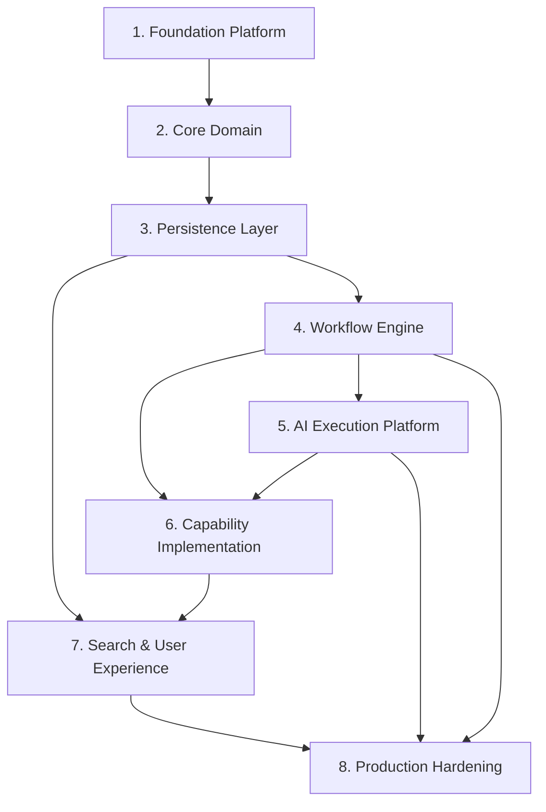

# Career Companion Implementation Roadmap

## 1. Executive Summary

This roadmap translates the approved Career Companion architecture into an engineering execution blueprint. It is derived from [Architecture Blueprint v1.0](../architecture/architecture-blueprint-v1.md) and ADR-001 through ADR-010.

The roadmap is not a sprint plan. It defines the dependency-aware implementation sequence required to build Career Companion with minimal architectural rework.

Implementation must preserve:

- Workflow-governed execution.
- Workflow Instance authority.
- Repository-per-aggregate persistence.
- PostgreSQL as authoritative transactional metadata store.
- S3-compatible object storage for immutable artifact content.
- OpenSearch as derived search only.
- LiteLLM as the only AI execution gateway.
- Human approval gates.
- Evidence authority.
- Auditability and recovery.

## 2. Implementation Principles

- Build architecture contracts before business features.
- Implement persistence boundaries before workflow mutation.
- Implement validation before automation.
- Implement one governed execution cycle before multiple capabilities.
- Keep AI behind the Model Gateway from the first AI-enabled capability.
- Keep search derived from the first index.
- Preserve artifact metadata/content separation.
- Make every consequential action auditable.
- Prefer thin vertical slices once the foundation exists.
- Avoid sprint-driven shortcuts that violate ADRs.

## 3. Engineering Strategy

Career Companion should be implemented in layers that follow architectural dependency order:

1. Foundation contracts and platform service boundaries.
2. Core domain models and validation invariants.
3. Repository-backed persistence.
4. Runtime and workflow execution.
5. AI execution boundary.
6. Capability implementation.
7. Search projections and user experience.
8. Production hardening.

The strategy is to build stable internal contracts first, then create one narrow end-to-end execution path, then expand capabilities.

Recommended first vertical slice:

```text
Workflow Instance
    ↓
Qualification Capability
    ↓
LiteLLM AI Execution
    ↓
Structured Output Validation
    ↓
Artifact Candidate
    ↓
Human Approval Gate
    ↓
PostgreSQL Metadata Commit
    ↓
Audit Record
    ↓
Derived Search Projection
```

This slice exercises the major architecture without prematurely implementing every capability.

## 4. Dependency Graph



Critical path:

```text
Foundation Platform
    ↓
Core Domain
    ↓
Persistence Layer
    ↓
Workflow Engine
    ↓
AI Execution Platform
    ↓
First Capability
    ↓
Search and UX
    ↓
Production Hardening
```

Parallelization should begin only after shared contracts are stable.

## 5. Implementation Phases

### Phase 1: Foundation Platform

Purpose:

Establish the shared engineering foundation required by all later layers.

Scope:

- Project structure for Career Companion implementation.
- Architecture contract locations.
- Configuration boundary.
- Policy boundary.
- Audit boundary.
- Observability boundary.
- Service contract conventions.
- Validation harness foundation.
- ADR compliance checks.

Deliverables:

- Platform service contract skeletons.
- Architecture invariant test framework.
- Configuration and policy abstractions.
- Audit and observability event contracts.
- Initial engineering documentation.

Dependencies:

- Architecture Blueprint v1.0.
- ADR-005 Platform Services Strategy.
- ADR-006 Technology Evaluation & Selection Principles.

Exit Criteria:

- Shared service boundaries are defined.
- No business capability depends on implementation-specific services directly.
- ADR compliance checks can run.
- Architecture invariant tests have a place to live.

### Phase 2: Core Domain

Purpose:

Implement domain models and contracts before persistence and runtime behavior.

Scope:

- Workflow Instance model.
- Artifact model.
- Evidence references.
- Approval records.
- Snapshot model.
- Audit record model.
- Capability metadata.
- Policy metadata.
- AI Execution Record contract.
- Validation rules.

Deliverables:

- Domain contracts.
- Domain validation rules.
- Immutable artifact metadata contract.
- Evidence chain contract.
- AI Execution Record contract.
- Capability contract registry shape.

Dependencies:

- Phase 1.
- Workflow State Machine.
- Artifact Model.
- Workflow Instance specification.
- ADR-001, ADR-004, ADR-010.

Exit Criteria:

- Domain objects can be validated without persistence.
- Required IDs, versions, lifecycle states, and authority rules are represented.
- AI Execution Record includes required ADR-010 fields.
- Approved artifacts, evidence, snapshots, and audit immutability rules are testable.

### Phase 3: Persistence Layer

Purpose:

Implement authoritative persistence boundaries.

Scope:

- PostgreSQL-backed repositories.
- Repository-per-aggregate contracts.
- Optimistic concurrency.
- Idempotency records.
- Artifact metadata persistence.
- Evidence metadata persistence.
- Approval registry persistence.
- Audit metadata persistence.
- Snapshot metadata persistence.
- Policy registry persistence.
- Capability registry persistence.
- Configuration metadata persistence.
- S3-compatible object storage adapter for artifact content.

Deliverables:

- Workflow Repository.
- Artifact Repository.
- Evidence Repository.
- Snapshot Repository.
- Audit Repository.
- Policy Repository.
- Capability Repository.
- Configuration Repository.
- Artifact content storage adapter.
- Migration and seed strategy.
- Persistence validation tests.

Dependencies:

- Phase 2.
- ADR-001.
- ADR-004.
- ADR-007.
- ADR-008.

Exit Criteria:

- PostgreSQL persists authoritative metadata.
- S3-compatible object storage stores artifact content.
- Artifact metadata/content split is enforced.
- Stale writes are rejected.
- Idempotency prevents duplicate commits.
- Audit is append-oriented.
- Recovery can locate latest valid projection and snapshot metadata.

### Phase 4: Workflow Engine

Purpose:

Implement governed workflow execution without AI-specific behavior.

Scope:

- Runtime Session.
- Orchestrator shell.
- Workflow Resolver.
- Transition Evaluator.
- Gate Evaluator.
- Approval Evaluator.
- Workflow Validator.
- Recovery Coordinator.
- Projection builder.
- One-capability-per-cycle enforcement.
- Waiting states.
- Cancellation and timeout records.

Deliverables:

- Workflow execution boundary.
- Runtime execution lifecycle.
- Governed commit path.
- Snapshot creation.
- Projection refresh.
- Recovery path.
- Approval gate handling.
- Workflow validation test suite.

Dependencies:

- Phase 3.
- ADR-002.
- ADR-003.
- Workflow State Machine.
- Runtime Architecture.
- Interaction Architecture.

Exit Criteria:

- Runtime can execute a non-AI placeholder capability through one governed cycle.
- Workflow transitions require validation.
- Human approval gates pause execution.
- Recovery appends history.
- UI or capability code cannot mutate workflow state directly.

### Phase 5: AI Execution Platform

Purpose:

Implement the governed AI execution boundary before AI capabilities are built.

Scope:

- LiteLLM-backed Model Gateway.
- Prompt Registry.
- Prompt versioning.
- Model routing policy.
- Structured output validation.
- Retry and fallback policy.
- Timeout policy.
- Token and cost accounting.
- AI Execution Record creation.
- AI observability.
- Provider independence enforcement.

Deliverables:

- AI Execution Platform contract.
- Model Gateway implementation boundary.
- Prompt Registry persistence integration.
- AI Execution Record persistence.
- Structured output validator.
- Cost and token telemetry.
- Direct-provider-call prevention checks.

Dependencies:

- Phase 4.
- ADR-005.
- ADR-006.
- ADR-010.

Exit Criteria:

- Capabilities cannot call providers directly.
- All AI execution passes through LiteLLM-backed gateway.
- Prompt IDs and versions are required.
- Raw LLM responses cannot enter workflow.
- Schema-invalid responses cannot create artifacts.
- AI Execution Record is created for every AI call.

### Phase 6: Capability Implementation

Purpose:

Implement business capabilities on top of governed workflow and AI execution.

Scope:

- Qualification capability.
- JD Intelligence capability.
- Resume Strategy capability.
- Resume QA capability.
- Initial Career Intelligence read-only capability.
- Capability validation.
- Artifact creation.
- Human review gates.

Deliverables:

- First production-grade capability.
- Capability input/output contracts.
- Capability validators.
- Artifact candidate generation.
- Evidence reference enforcement.
- Human approval integration.
- Capability-level tests.

Dependencies:

- Phase 5.
- Capability Contracts.
- Capability Architecture.
- Artifact Model.
- Memory & Evidence Architecture.

Exit Criteria:

- At least one AI-enabled capability completes end to end.
- Capability output is schema validated and capability validated.
- Artifacts are registered only through governed commit.
- Human review gates are enforced.
- Unsupported claims cannot become approved artifacts.

### Phase 7: Search & User Experience

Purpose:

Implement derived retrieval and operational surfaces after authoritative state exists.

Scope:

- OpenSearch index schema.
- Search projection pipeline.
- Search document contract.
- Search rebuild process.
- Authorization-aware search filtering.
- Workflow projection views.
- Artifact and evidence lookup.
- Review and approval surfaces.
- Operational status views.

Deliverables:

- Derived search indexes.
- Search rebuild command or workflow.
- Search staleness detection.
- Workflow status UI.
- Capability review UI.
- Approval gate UI.
- Artifact and evidence browser.

Dependencies:

- Phase 3.
- Phase 4.
- Phase 6.
- ADR-009.

Exit Criteria:

- Search can be rebuilt from PostgreSQL and immutable artifacts.
- Search results reference authoritative IDs and versions.
- Consequential use rehydrates authoritative records.
- Search cannot become workflow, artifact, or evidence authority.
- Users can complete the first workflow through the UI or operator surface.

### Phase 8: Production Hardening

Purpose:

Make the system safe, observable, recoverable, and operable.

Scope:

- Security hardening.
- Privacy validation.
- Authorization tests.
- Secrets boundary validation.
- Audit review.
- Observability dashboards.
- Cost monitoring.
- Failure and recovery testing.
- Backup and restore rehearsal.
- Migration rehearsal.
- Load and performance tests.
- Architecture compliance suite.

Deliverables:

- Production readiness checklist.
- Architecture compliance tests.
- Security and privacy validation.
- Recovery runbook.
- Operational dashboards.
- Cost and token reports.
- Failure-mode test suite.
- Release readiness report.

Dependencies:

- Phases 1 through 7.

Exit Criteria:

- No P0 architecture violations.
- Recovery tested for failed AI execution, failed commit, stale update, indexing failure, and artifact storage failure.
- Audit records are sufficient for consequential actions.
- Sensitive data boundaries are validated.
- Cost and token reporting is operational.
- Blueprint and ADR compliance are verified.

## 6. Parallel Workstreams

Parallel workstreams should start after the Foundation Platform contracts are stable.

### Workstream A: Domain and Validation

Owns domain contracts, validators, schema/version rules, invariants, and architecture compliance tests.

Can run in parallel with Persistence once domain contracts stabilize.

### Workstream B: Persistence and Storage

Owns PostgreSQL repositories, migrations, idempotency, optimistic concurrency, artifact content storage, and recovery metadata.

Depends on Core Domain.

### Workstream C: Workflow Runtime

Owns Runtime Session, Orchestrator, workflow evaluation, approvals, recovery, projections, and governed commit.

Depends on Persistence contracts.

### Workstream D: AI Platform

Owns LiteLLM gateway, Prompt Registry, model routing, output validation, execution records, cost governance, and observability.

Can begin contract design after Core Domain, but end-to-end integration depends on Workflow Runtime.

### Workstream E: Capabilities

Owns capability logic and validators.

Must not start production implementation until AI Platform and Workflow Runtime boundaries exist.

### Workstream F: Search and UX

Owns OpenSearch projections, search rebuild, UI/operator surfaces, review/approval views, and operational navigation.

Can begin UX prototypes early but production integration depends on authoritative persistence and workflow projections.

## 7. Engineering Milestones

Milestone 1: Architecture Contracts Ready

- Domain contracts exist.
- Service boundaries exist.
- ADR compliance test skeleton exists.

Milestone 2: Authoritative State Ready

- PostgreSQL repositories persist authoritative metadata.
- Artifact content storage adapter works.
- Audit, snapshots, and idempotency are testable.

Milestone 3: Governed Execution Ready

- Runtime Session and Orchestrator execute one governed cycle.
- Gates, waiting states, recovery, and projections work.

Milestone 4: AI Boundary Ready

- LiteLLM gateway is the only AI execution path.
- Prompt Registry, structured validation, AI Execution Records, and cost telemetry work.

Milestone 5: First Capability Ready

- One AI-enabled capability completes end to end.
- Output becomes an artifact only after validation.

Milestone 6: Derived Search Ready

- OpenSearch indexes rebuild from authoritative sources.
- Search results rehydrate authoritative records before consequential use.

Milestone 7: Operator Experience Ready

- User can initiate, review, approve, and inspect workflow execution.

Milestone 8: Production Readiness Ready

- Security, privacy, recovery, observability, cost, and architecture compliance validation pass.

## 8. Exit Criteria

Career Companion implementation is ready for controlled production use when:

- All Phase 8 exit criteria pass.
- ADR-001 through ADR-010 invariants are covered by tests or review checks.
- No capability can call an LLM provider directly.
- No workflow transition bypasses Workflow Instance and Orchestrator.
- No artifact content can be overwritten after registration.
- No search result is treated as authoritative.
- No AI output can become an artifact without schema and capability validation.
- PostgreSQL, object storage, OpenSearch, and LiteLLM boundaries are enforced.
- Recovery can resume from authoritative records.
- Audit records are complete enough for review.
- Human approval gates are enforced.

## 9. Risks & Mitigations

| Risk | Impact | Mitigation |
| --- | --- | --- |
| Architecture contracts are skipped in favor of feature work | Rework and boundary violations | Build contracts and validation first |
| PostgreSQL becomes search/cache/document storage | Authority confusion and scale risk | Enforce ADR-004, ADR-007, ADR-008, ADR-009 |
| Capabilities call providers directly | AI governance failure | Add dependency checks and gateway-only tests |
| Search becomes authoritative | Incorrect decisions from stale projections | Require authoritative rehydration |
| Prompt versions drift | Irreproducible AI outputs | Enforce Prompt Registry and AI Execution Records |
| Runtime becomes stateful | Recovery and concurrency defects | Enforce Runtime Session ephemerality |
| Artifact immutability is weak | Evidence and review risk | Hash, version, and storage-key validation |
| Recovery is added too late | Production instability | Implement recovery with Workflow Engine |
| UX hides governance state | Operator errors | Surface gates, evidence, status, and warnings |
| Cost tracking is deferred | AI spend blind spots | Implement token and cost telemetry in Phase 5 |

## 10. Future Phases

Future phases after v1 implementation:

- Additional capabilities beyond qualification and resume strategy.
- Interview preparation and debrief capabilities.
- Recruiter communication drafting.
- Advisory memory technology selection.
- Cache technology selection.
- Analytics architecture.
- Deployment architecture.
- Identity and authorization provider selection.
- Advanced AI evaluation and model portfolio governance.
- Prompt quality evaluation framework.
- Search relevance tuning and hybrid retrieval refinement.
- Multi-application operational analytics.

Future phases must continue through ADR review and must not bypass the architecture blueprint.
