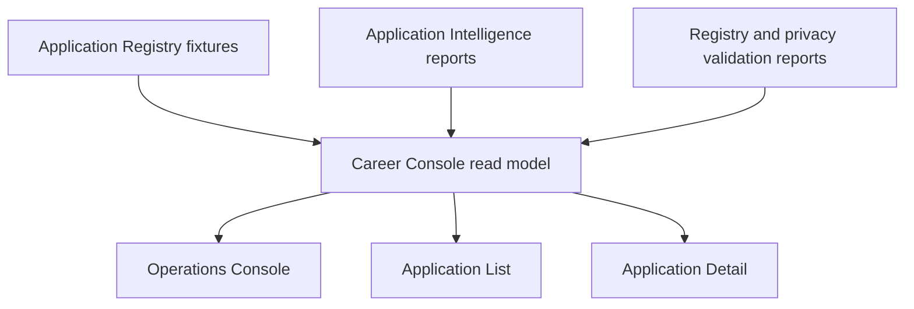

# Career Operations Console Architecture

## Purpose

The Career Operations Console is the first visual operating interface for Career OS. It answers one operational question first: what should I do next?

## Scope

Implemented in this sprint:

- Career OS shell
- Operations Console
- Application list
- Read-only application detail
- Task center
- Registry health
- Deterministic daily brief

Placeholders:

- Home
- Analytics
- Resume OS
- Settings

## Data Flow

## Read-Only Boundary

The console reads committed public-safe fixtures and generated intelligence reports. It does not create, update, delete, archive, or mutate registry records.

## Source Files

- `lib/career-console-data.ts`
- `components/career-console/career-shell.tsx`
- `components/career-console/operations-console.tsx`
- `components/career-console/application-table.tsx`
- `app/career-os/**`

