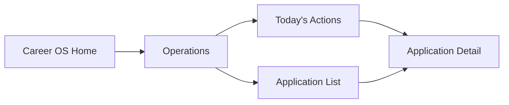

# Career Console Navigation

## Information Architecture

Career OS uses six primary navigation entries:

- Home
- Operations
- Applications
- Analytics
- Resume OS
- Settings

Only Operations is fully implemented in Sprint 18.3. Applications is implemented as a supporting operational surface because every action needs a detail destination.

## Primary Journey

## Navigation Rules

- The sidebar persists across Career OS routes.
- Breadcrumbs show the current location.
- Every operational action links to an application detail page.
- Placeholder modules return users to Operations.
- Product OS remains accessible from the shell.

