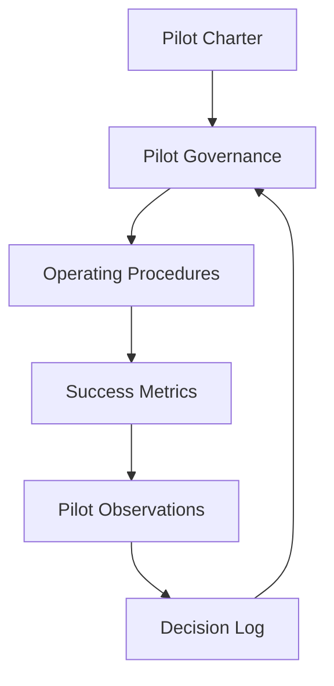

# Career OS Pilot

## Purpose

This folder contains every document required to operate the Career OS Pilot in a consistent, repeatable, and evidence-driven manner.

It defines:

- Governance.
- Operating procedures.
- Success metrics.
- Decision-making.
- Terminology.
- Product learning.

These documents should evolve only through deliberate governance changes. The pilot should not accumulate new process documents casually; governance changes should be based on observed pilot needs and Product Owner approval.

## Recommended Reading Order

1. [pilot-charter.md](pilot-charter.md)

   Purpose: Understand why the pilot exists.

2. [pilot-governance.md](pilot-governance.md)

   Purpose: Understand how the pilot is governed.

3. [operating-procedures.md](operating-procedures.md)

   Purpose: Understand the operational workflow.

4. [success-metrics.md](success-metrics.md)

   Purpose: Understand how pilot success is measured.

5. [glossary.md](glossary.md)

   Purpose: Understand standard terminology.

6. [pilot-decision-log.md](pilot-decision-log.md)

   Purpose: Review historical product decisions made during the pilot.

## Document Relationships

The documents form a governance system:

- The Charter defines why the pilot exists and what success means.
- Governance defines how decisions, changes, data, metrics, and defects are controlled.
- Operating Procedures define how the pilot is executed application by application.
- Success Metrics define how evidence is measured and interpreted.
- Observations capture workflow friction, defects, and product-learning signals.
- The Decision Log records why significant product decisions were made.

## Governance Principles

- Evidence before opinion.
- Privacy by default.
- Human approval for external actions.
- Deterministic analytics.
- Stable baseline during pilot.
- Product learning over feature expansion.

## Adding New Governance Documents

New governance documents should only be created when:

- Existing documents become difficult to maintain.
- A recurring governance need is observed.
- The Product Owner approves the addition.

Avoid unnecessary documentation sprawl. Prefer improving an existing document unless a new artifact creates a clearer operating boundary.

