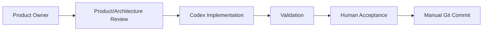
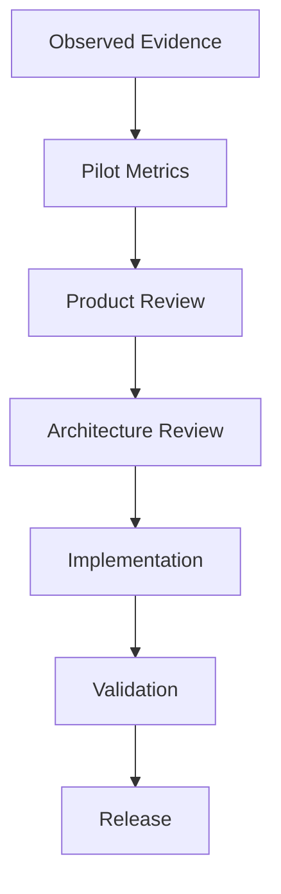

# Career OS Pilot Governance

## Governance Model

Career OS pilot changes follow this workflow:

The Product Owner controls policy, acceptance, and privacy decisions. Codex implements approved changes and runs validation. The validation framework provides automated quality gates but does not replace human acceptance.

## Decision Hierarchy

All product decisions during the pilot should follow this order:

This ordering matters because the pilot exists to learn from real operation, not to reward feature velocity. Observed Evidence comes before assumptions so decisions are grounded in actual workflow behavior. Pilot Metrics come before Product Review so interpretations include denominators, maturity, and sample-size context. Product Review comes before Architecture Review so the problem is understood before implementation design begins.

Architecture Review comes before Implementation to prevent narrow fixes from creating broader system inconsistency. Validation comes before Release so privacy, traceability, and operational reliability are protected. The pilot prioritizes product discipline over feature velocity.

## Change-Control Policy

### Emergency Change

Allowed for:

- Privacy breach.
- Data corruption.
- Destructive behavior.
- Blocked core workflow.
- Invalid lifecycle transition causing material record inconsistency.

Emergency changes may be released immediately after validation and human acceptance.

### Pilot Correction

Allowed for:

- Recurring high-friction workflow problem.
- Incorrect deterministic metric.
- Broken traceability.
- Misleading operational warning.
- Significant accessibility defect.

Pilot corrections should be batched when practical.

### Deferred Enhancement

Includes:

- Cosmetic improvement.
- Speculative automation.
- New analytics.
- New integration.
- New module.
- Low-frequency convenience feature.

Deferred enhancements should be reviewed after the pilot unless they become P0 or P1 issues.

Every change proposal must contain:

- Problem statement.
- Evidence.
- Frequency.
- Severity.
- Affected applications.
- Proposed fix.
- Expected impact.
- Regression risk.
- Acceptance criteria.

## Freeze Policy

- Baseline architecture remains frozen.
- No major functionality is added during the pilot.
- All approved changes must be documented.
- Emergency fixes may be released immediately after validation.
- Pilot corrections should be batched when practical.
- Every pilot software change requires a new commit.
- Material changes require a new pilot patch tag.

Recommended patch-tag format:

- `career-os-v1.0.1-pilot`
- `career-os-v1.0.2-pilot`

Do not create tags without explicit Product Owner approval.

## Defect Severity

- P0: Privacy breach, destructive behavior, corrupted or lost records.
- P1: Core workflow cannot be completed or results are materially wrong.
- P2: Substantial friction, confusing workflow, or recoverable inconsistency.
- P3: Cosmetic, minor accessibility, or low-impact usability issue.

These severity definitions are shared with [operating-procedures.md](operating-procedures.md#sop-15--defect-reporting) and [glossary.md](glossary.md).

## Application Data Governance

- Real application data must remain private and local-first.
- Synthetic data must remain clearly separated.
- Application URLs, recruiter names, notes, compensation, interview details, and outcomes are private by default.
- Private records must never be committed.
- Only anonymized aggregate insights may enter public documentation.
- Raw email content should not be stored unless strictly necessary.
- Confidential interview content must not be stored.
- Rejection reason must not be inferred.
- Status transition must not be inferred from silence.

## Evidence Quality Rules

Career OS evidence must be classified as one of:

- Observed fact: directly seen or produced by the operator.
- User-entered fact: manually entered by the Product Owner.
- Employer-provided outcome: explicit communication from an employer or recruiting system.
- Derived deterministic metric: calculated from recorded fields using documented rules.
- User interpretation: Product Owner interpretation of observed behavior.
- Hypothesis: unproven explanation or belief.

Hypotheses must be labelled as hypotheses and must not be presented as facts.

## Metric Governance

- Denominators must be explicit.
- Discovered or saved roles do not count as submitted applications.
- Immature applications must not be treated as terminal outcomes.
- Duplicate applications must not inflate metrics.
- Directional findings must be labelled as directional.
- Resume-performance comparisons require context and sample size.
- Referral and application-source effects must be acknowledged.

Metric definitions are maintained in [success-metrics.md](success-metrics.md).

## Review Cadence

- Per-application validation after each submitted application.
- Daily operational review on active search days.
- Weekly pilot review.
- Review after the first 5 submitted applications.
- Final review after outcome observation.

## Decision Gates

### GO

Continue the pilot when privacy validation passes, no unresolved P0 exists, core workflows are usable, and traceability is intact.

### REVISE

Pause or adjust the pilot when P1 defects, repeated P2 friction, misleading metrics, or incomplete traceability reduce confidence but can be corrected.

### STOP

Stop the pilot when there is an unresolved P0, repeated data corruption, private data exposure, destructive behavior, or a workflow failure that prevents reliable operation.

These meanings are shared with [operating-procedures.md](operating-procedures.md#sop-17--five-application-review-gate), [operating-procedures.md](operating-procedures.md#sop-18--final-pilot-review), and [glossary.md](glossary.md).

## Audit Trail

Important actions must be recoverable through:

- Application events.
- Resume snapshot references.
- JD snapshot references.
- Task history.
- Lifecycle transitions.
- Git history for software changes.
