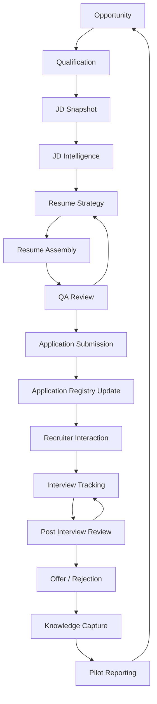

# Career OS Pilot Workflow

## Overview

The Career OS Pilot Workflow defines the deterministic end-to-end operating model for every job application processed during the pilot. Every application follows the same lifecycle, uses the same decision gates, and produces traceable artifacts from opportunity intake through pilot reporting.

## Workflow Philosophy

Career OS prioritizes repeatability, privacy, traceability, and product learning. The workflow is intentionally deterministic: each stage has a defined purpose, required inputs, required outputs, owner, evidence, decisions, failure conditions, and exit criteria.

## Operational Principles

- Use real opportunities only.
- Capture evidence before making workflow decisions.
- Keep real application data private and local-first.
- Require human approval for external actions.
- Treat analytics as deterministic and directional.
- Do not infer employer outcomes from silence.
- Preserve JD-to-resume-to-application traceability.
- Capture product learning after every meaningful workflow step.

## High-Level Workflow Diagram

## Lifecycle Stages

### 1. Opportunity

| Field | Definition |
| --- | --- |
| Purpose | Capture a potential role before committing pilot effort. |
| Inputs | Role source, company, role title, location, work mode, source URL, initial interest. |
| Outputs | Opportunity intake artifact. |
| Responsible Owner | Saurabh Chawda. |
| Success Criteria | Opportunity is real, identifiable, and worth qualification. |
| Required Evidence | Source URL or source note, company name, role title. |
| Required Documents | [01-opportunity-intake.md](operational-templates/01-opportunity-intake.md). |
| Possible Decisions | Continue to Qualification, park, reject. |
| Failure Conditions | Role is fake, closed, duplicate, unavailable, or not aligned to pilot scope. |
| Exit Criteria | Intake completed and decision recorded. |
| Next Stage | Qualification. |
| Exception Handling | If source data is incomplete, mark as parked until enough information exists. |

### 2. Qualification

| Field | Definition |
| --- | --- |
| Purpose | Decide whether the opportunity deserves full JD and resume workflow investment. |
| Inputs | Opportunity intake, role requirements, location/work mode, pilot scope, current application load. |
| Outputs | Qualification artifact and Gate 1 decision. |
| Responsible Owner | Saurabh Chawda. |
| Success Criteria | Role is eligible and worth applying to. |
| Required Evidence | Minimum eligibility checklist, duplicate check, location/work-mode fit. |
| Required Documents | [02-qualification.md](operational-templates/02-qualification.md), [decision-gates.md](decision-gates.md#gate-1--proceed--reject-opportunity). |
| Possible Decisions | Proceed, reject, park for more information. |
| Failure Conditions | Duplicate application, unsuitable role, closed role, no willingness to interview, insufficient JD. |
| Exit Criteria | Qualification decision recorded. |
| Next Stage | JD Snapshot. |
| Exception Handling | If promising but incomplete, return to Opportunity with a parked status. |

### 3. JD Snapshot

| Field | Definition |
| --- | --- |
| Purpose | Preserve a stable local job description source for analysis and traceability. |
| Inputs | Qualified opportunity, source URL, posting content, capture date. |
| Outputs | JD Snapshot artifact and JD Snapshot ID. |
| Responsible Owner | Saurabh Chawda. |
| Success Criteria | JD is stable, locally captured, and not dependent on live URL alone. |
| Required Evidence | Source URL, capture date, posting ID where available, company and role identifiers. |
| Required Documents | [03-jd-snapshot.md](operational-templates/03-jd-snapshot.md). |
| Possible Decisions | Continue, request more JD detail, reject if evidence is insufficient. |
| Failure Conditions | Missing role content, unstable source, unavailable role, private content stored in public path. |
| Exit Criteria | JD Snapshot is captured and classified. |
| Next Stage | JD Intelligence. |
| Exception Handling | Store sensitive JD notes in private local storage when required. |

### 4. JD Intelligence

| Field | Definition |
| --- | --- |
| Purpose | Analyze the JD into archetypes, competencies, keywords, risks, and evidence needs. |
| Inputs | JD Snapshot, role scope, Resume OS evidence. |
| Outputs | JD Intelligence report, risks, gaps, recommended evidence. |
| Responsible Owner | Career OS validation framework with Saurabh review. |
| Success Criteria | Archetype, seniority, competencies, keywords, and gaps are explainable. |
| Required Evidence | JD Snapshot, analysis output, validation result. |
| Required Documents | [04-jd-intelligence.md](operational-templates/04-jd-intelligence.md). |
| Possible Decisions | Proceed to Resume Strategy, revise qualification, reject. |
| Failure Conditions | Unsupported requirements, misleading archetype, missing mandatory evidence, validation failure. |
| Exit Criteria | Gate 2 decision recorded. |
| Next Stage | Resume Strategy. |
| Exception Handling | If analysis is ambiguous, require human review before resume generation. |

### 5. Resume Strategy

| Field | Definition |
| --- | --- |
| Purpose | Define positioning before assembly so the resume reflects verified fit. |
| Inputs | JD Intelligence report, canonical evidence, role archetype, gaps. |
| Outputs | Resume strategy artifact, target positioning, selected evidence. |
| Responsible Owner | Saurabh Chawda. |
| Success Criteria | Strategy is role-relevant, truthful, and traceable. |
| Required Evidence | Selected achievements, evidence gaps, Product OS proof points. |
| Required Documents | [05-resume-strategy.md](operational-templates/05-resume-strategy.md). |
| Possible Decisions | Proceed, adjust evidence, reject, park. |
| Failure Conditions | Strategy depends on unsupported claims or excessive manual invention. |
| Exit Criteria | Approved resume strategy. |
| Next Stage | Resume Assembly. |
| Exception Handling | If evidence is weak, document mitigation or reject the application. |

### 6. Resume Assembly

| Field | Definition |
| --- | --- |
| Purpose | Assemble the resume from verified Resume OS components without inventing facts. |
| Inputs | Resume strategy, canonical evidence, component library, bullet library. |
| Outputs | Resume assembly plan, draft resume, evidence map. |
| Responsible Owner | Resume OS with Saurabh review. |
| Success Criteria | Draft is traceable, ATS-safe, and aligned to strategy. |
| Required Evidence | Achievement IDs, component IDs, evidence map. |
| Required Documents | [06-resume-assembly-plan.md](operational-templates/06-resume-assembly-plan.md). |
| Possible Decisions | Proceed to QA, revise strategy, revise assembly. |
| Failure Conditions | Unsupported claims, missing traceability, excessive length, broken evidence map. |
| Exit Criteria | Draft and evidence map complete. |
| Next Stage | QA Review. |
| Exception Handling | Manual overrides must be captured when assembly requires human changes. |

### 7. QA Review

| Field | Definition |
| --- | --- |
| Purpose | Verify factual integrity, relevance, human readability, ATS fit, and recruiter first impression. |
| Inputs | Resume draft, evidence map, JD Intelligence report, Resume Strategy. |
| Outputs | QA checklist, approval decision, manual override notes. |
| Responsible Owner | Saurabh Chawda. |
| Success Criteria | Resume is approved for submission. |
| Required Evidence | QA checklist, validation status, unresolved-risk review. |
| Required Documents | [07-qa-checklist.md](operational-templates/07-qa-checklist.md), [decision-gates.md](decision-gates.md#gate-3--qa-approval). |
| Possible Decisions | Approve, revise, reject. |
| Failure Conditions | Unsupported claim, broken link, poor ATS fit, unreadable summary, privacy risk. |
| Exit Criteria | Gate 3 QA approval recorded. |
| Next Stage | Application Submission. |
| Exception Handling | Return to Resume Strategy or Resume Assembly based on defect type. |

### 8. Application Submission

| Field | Definition |
| --- | --- |
| Purpose | Submit the application manually after QA approval. |
| Inputs | Approved resume export, JD Snapshot, source channel, application portal. |
| Outputs | Submission record, confirmation where available. |
| Responsible Owner | Saurabh Chawda. |
| Success Criteria | Application is submitted manually and submission details are captured. |
| Required Evidence | Submission date, source/channel, confirmation where available. |
| Required Documents | [08-application-submission.md](operational-templates/08-application-submission.md), [decision-gates.md](decision-gates.md#gate-4--ready-for-submission). |
| Possible Decisions | Submit, defer, cancel. |
| Failure Conditions | Portal closed, role closed, resume not approved, missing required information. |
| Exit Criteria | Submission completed or cancellation documented. |
| Next Stage | Application Registry Update. |
| Exception Handling | If submission fails, document failure and retry only with Product Owner approval. |

### 9. Application Registry Update

| Field | Definition |
| --- | --- |
| Purpose | Create or update the application record with traceability and next action. |
| Inputs | Submission artifact, JD Snapshot ID, Resume Snapshot ID, export ID, source/channel. |
| Outputs | Application record, lifecycle event, task or valid waiting state. |
| Responsible Owner | Saurabh Chawda. |
| Success Criteria | Application record is complete and traceable. |
| Required Evidence | Application ID, JD Snapshot ID, Resume ID, submission date, current stage, status, next action. |
| Required Documents | [09-registry-update.md](operational-templates/09-registry-update.md). |
| Possible Decisions | Active, waiting, needs follow-up, correction required. |
| Failure Conditions | Missing required field, missing traceability, duplicate record, privacy unsafe location. |
| Exit Criteria | Registry update complete and validation-ready. |
| Next Stage | Recruiter Interaction. |
| Exception Handling | If traceability is missing, block further reporting until corrected. |

### 10. Recruiter Interaction

| Field | Definition |
| --- | --- |
| Purpose | Track explicit employer or recruiter responses without storing unnecessary raw communication. |
| Inputs | Response, contact reference, application record. |
| Outputs | Recruiter interaction log, contact update, lifecycle transition, next action. |
| Responsible Owner | Saurabh Chawda. |
| Success Criteria | Explicit response is recorded with appropriate privacy controls. |
| Required Evidence | Response date, source, contact reference, stage decision. |
| Required Documents | [10-recruiter-interaction-log.md](operational-templates/10-recruiter-interaction-log.md). |
| Possible Decisions | Recruiter screen, interview, rejection, waiting, no action. |
| Failure Conditions | Inferred response, raw private communication stored publicly, missing next action. |
| Exit Criteria | Response and next action recorded. |
| Next Stage | Interview Tracking or Offer / Rejection. |
| Exception Handling | Silence remains waiting or stale; it is not an inferred rejection. |

### 11. Interview Tracking

| Field | Definition |
| --- | --- |
| Purpose | Track scheduled and completed interviews with privacy-safe evidence. |
| Inputs | Interview invitation, stage, schedule, format, preparation tasks. |
| Outputs | Interview log, task updates, lifecycle event. |
| Responsible Owner | Saurabh Chawda. |
| Success Criteria | Interview is tracked without storing confidential questions or private employer content. |
| Required Evidence | Stage, date, format, preparation task, completion status. |
| Required Documents | [11-interview-log.md](operational-templates/11-interview-log.md). |
| Possible Decisions | Prepare, reschedule, complete, withdraw, reject. |
| Failure Conditions | Missing schedule, confidential content stored, no completion status. |
| Exit Criteria | Interview status and next action recorded. |
| Next Stage | Post Interview Review. |
| Exception Handling | If rescheduled, preserve original event and create updated task. |

### 12. Post Interview Review

| Field | Definition |
| --- | --- |
| Purpose | Capture learning from the interview while memory is fresh and privacy-safe. |
| Inputs | Interview log, preparation notes, outcome if available. |
| Outputs | Post-interview review artifact and learning notes. |
| Responsible Owner | Saurabh Chawda. |
| Success Criteria | Learning captured without confidential interview-question storage. |
| Required Evidence | Date, stage, preparation effectiveness, follow-up action. |
| Required Documents | [11-interview-log.md](operational-templates/11-interview-log.md), [13-pilot-observation.md](operational-templates/13-pilot-observation.md). |
| Possible Decisions | Continue, follow up, wait, withdraw, record rejection. |
| Failure Conditions | No review captured, confidential content stored, missing next action. |
| Exit Criteria | Review and next action complete. |
| Next Stage | Offer / Rejection. |
| Exception Handling | If outcome is pending, keep valid waiting state. |

### 13. Offer / Rejection

| Field | Definition |
| --- | --- |
| Purpose | Record explicit terminal or offer-stage outcomes. |
| Inputs | Employer outcome, application record, contact record. |
| Outputs | Outcome update, terminal event or offer-stage event, private notes where needed. |
| Responsible Owner | Saurabh Chawda. |
| Success Criteria | Outcome is explicit, correctly classified, and privacy-safe. |
| Required Evidence | Employer-provided outcome date and source. |
| Required Documents | [09-registry-update.md](operational-templates/09-registry-update.md). |
| Possible Decisions | Offer, accepted, rejected, withdrawn, closed, waiting. |
| Failure Conditions | Outcome inferred from silence, compensation stored publicly, missing outcome date. |
| Exit Criteria | Outcome recorded or valid waiting state maintained. |
| Next Stage | Knowledge Capture. |
| Exception Handling | Compensation and negotiation details remain private. |

### 14. Knowledge Capture

| Field | Definition |
| --- | --- |
| Purpose | Capture pilot learning from the application workflow and outcome. |
| Inputs | Application artifacts, metrics, friction notes, defects, outcomes. |
| Outputs | Pilot observation, decision-log entry when needed, roadmap input. |
| Responsible Owner | Saurabh Chawda. |
| Success Criteria | Learning is evidence-based and privacy-safe. |
| Required Evidence | Friction, timing, defects, useful console actions, manual overrides. |
| Required Documents | [13-pilot-observation.md](operational-templates/13-pilot-observation.md), [14-decision-log-entry.md](operational-templates/14-decision-log-entry.md). |
| Possible Decisions | No change, defect, pilot correction, deferred enhancement, roadmap item. |
| Failure Conditions | Learning not captured, speculation presented as fact, private data included. |
| Exit Criteria | Observation complete. |
| Next Stage | Pilot Reporting. |
| Exception Handling | Mark hypotheses explicitly and defer unsupported conclusions. |

### 15. Pilot Reporting

| Field | Definition |
| --- | --- |
| Purpose | Aggregate pilot evidence into weekly and final reporting. |
| Inputs | Registry metrics, privacy validation, pilot observations, defects, decisions. |
| Outputs | Weekly review, final pilot report, postmortem when needed. |
| Responsible Owner | Saurabh Chawda. |
| Success Criteria | Report is directional, anonymized, and actionable. |
| Required Evidence | Metrics with denominators, validation status, friction patterns, decision log. |
| Required Documents | [12-weekly-review.md](operational-templates/12-weekly-review.md), [15-postmortem.md](operational-templates/15-postmortem.md), [16-final-pilot-report.md](operational-templates/16-final-pilot-report.md). |
| Possible Decisions | Continue, revise, stop, patch release, roadmap update. |
| Failure Conditions | Private data included, rates without sample size, premature conclusions. |
| Exit Criteria | Pilot report completed and next roadmap decision recorded. |
| Next Stage | Opportunity for continued pilot cycle or final closeout. |
| Exception Handling | If sample is immature, label findings as incomplete or directional. |

