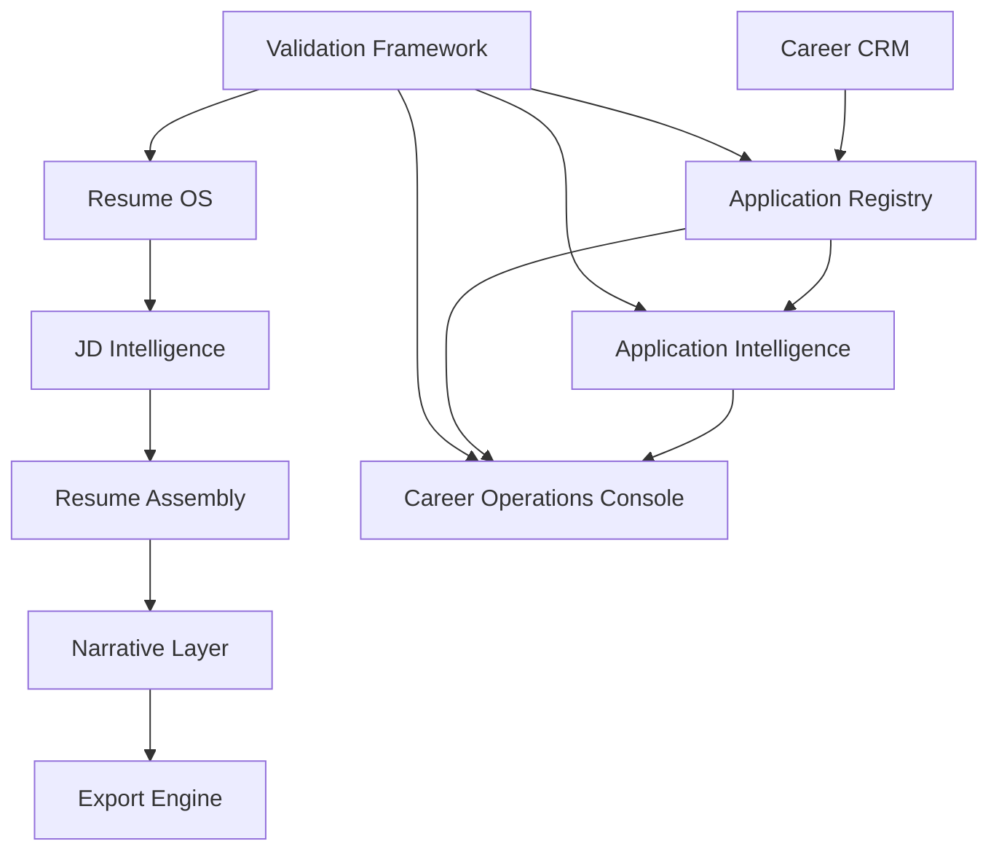

# Career OS v1.0.0 Pilot Release

## Release Name

Career OS v1.0.0 Pilot

## Release Date

July 18, 2026

## Commit Hash

`d745d001b8429be8e2c2bdcee77471a14bcbf6f5`

## Why this Release Exists

Career OS has reached the point where adding more architecture is less valuable than validating the system against real job-search operations. The architecture is frozen so the pilot can measure the system as an integrated product rather than as a moving collection of modules.

Real-world validation is now the highest-value work because it will reveal whether the operating system actually reduces application effort, improves traceability, protects factual integrity, and helps identify the next best action during an active search. New features can wait until the pilot shows which workflow gaps are real.

Pilot findings should drive future roadmap decisions. Defects, repeated manual work, unclear screens, privacy risks, missing evidence paths, and export friction should become the inputs for the next release sequence.

## Modules Included

- Resume OS
- JD Intelligence
- Resume Assembly
- Narrative Layer
- Export Engine
- Application Registry
- Career CRM
- Application Intelligence
- Career Operations Console
- Validation Framework

## Architecture Diagram

## Features

- Canonical career evidence and resume component library.
- Deterministic JD Intelligence and validation fixtures.
- Resume assembly, narrative review, and export workflow.
- Application Registry with task, contact, lifecycle, privacy, and validation support.
- Application Intelligence metrics and synthetic analytics projection.
- Career Operations Console with action-first operations, pipeline view, warnings, task center, registry health, and application detail pages.
- Local validation commands for resume, registry, intelligence, export, and console readiness.

## Known Limitations

- Career Operations Console currently renders public-safe synthetic registry data.
- Console is read-only and does not create, update, delete, or archive applications.
- Analytics, Resume OS, and Settings console modules are placeholders.
- Browser-based accessibility automation is not yet implemented.
- No Gmail, LinkedIn, Calendar, notification, authentication, or multi-user integration is included.
- Real pilot data must remain private and outside committed public fixtures.

## Pilot Scope

The pilot validates Career OS as a local-first job-search operating system for one candidate. The pilot scope includes using Resume OS, Application Registry, Application Intelligence, and the Career Operations Console to manage real-world application operations while preserving factual integrity, privacy, and traceability.

## Validation Summary

Required validation gates for the pilot baseline:

- Build passes.
- Typecheck passes.
- Lint passes.
- Privacy validation passes.
- Registry validation passes.
- Application Intelligence validation passes.
- Career Console validation passes.
- Git working tree is clean before tag creation.

## Release Checklist

- [x] Build passes.
- [x] Typecheck passes.
- [x] Lint passes.
- [x] Privacy validation passes.
- [x] Registry validation passes.
- [x] Application Intelligence validation passes.
- [x] Console validation passes.
- [ ] Git working tree clean after release documentation is committed.
