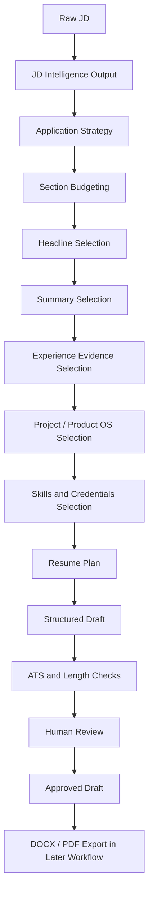

# Resume Assembly Engine

## Purpose

The Resume Assembly Engine converts a validated JD Intelligence result into a structured two-page resume draft. It is deterministic, local-first, and evidence-constrained.

The engine does not produce final resumes. Every output is a draft until human review is complete.

## Inputs

- JD Intelligence output.
- Candidate profile.
- Canonical achievements.
- Employment history.
- Approved bullet libraries.
- Approved components.
- Product OS project mappings.
- User overrides.
- Prohibited claims.

## Outputs

- Resume Plan.
- Structured resume draft.
- Markdown resume draft.
- Evidence map.
- Validation summary.
- Human-review checklist.

## Processing Stages

## Decision Rules

- Generate the Resume Plan before the draft.
- Preserve canonical employment titles, dates, companies, and chronology.
- Select only bullets that map to canonical achievement IDs.
- Select primary-archetype bullets first.
- Use secondary-archetype evidence only when it adds distinct proof.
- Keep Product OS as proof, not as a substitute for work experience.
- Keep simulations clearly labeled.
- Stop on P0 integrity failures.

## Assembly Constraints

- Two-page target.
- ATS-safe Markdown and JSON outputs.
- No columns, tables, icons, graphics, images, QR codes, or decorative formatting.
- No unsupported skills.
- No copied JD blocks.
- No final status without human review.

## Human-Review Controls

Human review is required for:

- Final claim wording.
- Product OS or project section inclusion.
- Any gap mitigation.
- Any inferred relocation or authorization statement.
- Any low-confidence JD Intelligence recommendation.

## Failure States

- Missing JD Intelligence output.
- Missing canonical achievement.
- Missing bullet ID.
- Broken Product OS URL.
- Page estimate above two pages after trimming.
- Unsupported claim.
- Simulation presented as production.
- Modified canonical fact.
- Confidential content exposure.

## Explainability Requirements

Every selected item must include:

- Source file.
- Achievement ID or project ID.
- JD signal addressed.
- Reason for selection.
- Word-count impact.
- Human-review note where applicable.

## Relationships

JD Intelligence defines the application strategy. Canonical evidence defines what can be claimed. Product OS supplies public proof. Resume QA later verifies factual integrity, ATS quality, formatting, and final readiness.

## Known Limitations

- Drafts are Markdown and JSON only in this sprint.
- DOCX and PDF export are deferred.
- Line and page counts are estimates.
- Human approval remains mandatory.

