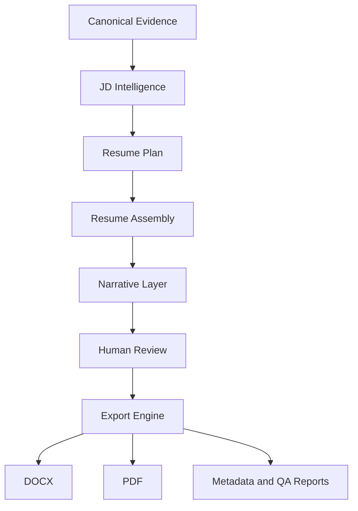

# Resume OS Export Architecture

Last updated: 2026-07-17

## Purpose

The Export Engine converts an approved Resume OS draft into DOCX and PDF artifacts. It is a rendering subsystem only. It must never rewrite facts, metrics, wording, chronology, ordering, evidence IDs, links, or Product OS references.

## Position in Resume OS

## Inputs

- Approved resume draft JSON.
- Resume metadata, section structure, bullets, contact links, Product OS links, evidence IDs, and selected project/module references.

## Outputs

- Editable DOCX.
- Searchable PDF.
- Metadata report.
- Export QA report.
- Pagination and formatting diagnostics.

## Non-Mutation Contract

The renderer may change only presentation. It may not:

- Change text.
- Change bullet order.
- Change section order.
- Change metric values.
- Change dates or company names.
- Add unsupported content.
- Remove evidence IDs or Product OS references from metadata.

## Failure Model

Export fails when:

- Content counts change.
- Protected metrics/dates/IDs change.
- Required sections are missing.
- Unsupported formatting is detected.
- DOCX or PDF is not generated.
- PDF is not searchable.
- Page count exceeds accepted bounds.

