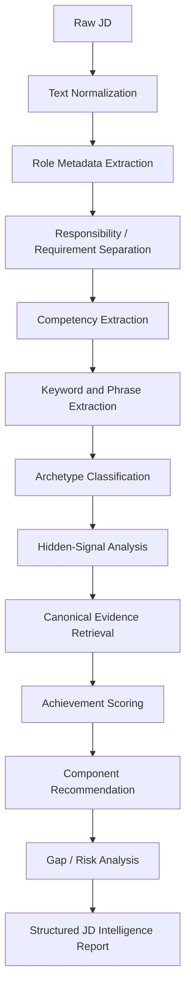

# JD Intelligence Engine

## Purpose

The JD Intelligence Engine converts a job description into a structured application strategy. It does not generate a final resume. It parses the role, identifies the strongest verified Resume OS evidence, recommends reusable components, and exposes gaps that require human judgment.

The engine exists to make resume tailoring faster, more consistent, and more defensible.

## Users

Primary user:

- Saurabh Chawda, tailoring resumes for Senior Product Manager, Lead Product Manager, AI Product Manager, Platform PM, Growth PM, Monetization PM, Payments PM, and Enterprise SaaS roles.

Secondary users:

- Recruiters who need relevance quickly.
- Hiring managers who need evidence of product judgment.
- ATS and AI screening systems that need clean terminology.
- Referrers and interview panels who need a coherent candidate narrative.

## Inputs

- Raw job description text.
- Source URL when available.
- Company context supplied by the user.
- Resume OS canonical data.
- Resume OS achievement and project metadata.
- Resume OS bullet libraries.
- Product OS public evidence links.
- GitHub flagship repository links.

## Outputs

- Normalized role metadata.
- Primary role archetype and up to two secondary archetypes.
- Competencies and ATS keywords.
- Hidden hiring signals with supporting JD phrases.
- Ranked achievements.
- Ranked bullet candidates.
- Recommended headline, summary direction, skills ordering, project, and Product OS evidence.
- Gap and risk analysis.
- Human-review checklist.
- Final application recommendation.

## Architecture

Resume OS is the relevance and routing layer. Product OS is the proof layer. The JD Intelligence Engine sits between the raw job description and the future resume assembly engine.

## Processing Stages

1. Text normalization
   - Preserve original JD text.
   - Remove formatting noise.
   - Normalize common role and domain variants.
   - Retain section boundaries where possible.

2. Role metadata extraction
   - Extract company, role title, level, location, work model, employment type, product domain, customer type, and product type.
   - Separate direct facts from inferred labels.

3. Responsibility and requirement separation
   - Separate responsibilities, required qualifications, preferred qualifications, technical requirements, leadership expectations, boilerplate, and application instructions.

4. Competency extraction
   - Map JD language to canonical Resume OS competency labels.
   - Preserve source phrases for explainability.

5. Keyword and phrase extraction
   - Rank required, repeated, domain-specific, technical, and leadership terms.
   - Flag dangerous terms that should not be mirrored without evidence.

6. Archetype classification
   - Use weighted scoring across the ten supported PM archetypes.
   - Return one primary archetype and up to two secondary archetypes.

7. Hidden-signal analysis
   - Infer implicit hiring expectations only when supported by JD phrases.
   - Label all hidden signals as inferences.

8. Canonical evidence retrieval
   - Retrieve achievements, projects, bullets, components, Product OS assets, and GitHub repositories.
   - Never recommend unsupported evidence.

9. Achievement scoring
   - Score retrieved achievements using weighted relevance, evidence strength, seniority alignment, recency, business impact, and interview defensibility.

10. Component recommendation
    - Recommend reusable Resume OS components with evidence IDs and rationale.

11. Gap and risk analysis
    - Identify missing evidence, overclaiming risk, seniority mismatch, domain gaps, and interview defensibility issues.

12. Structured report
    - Produce a machine-readable output and a human-readable analysis report.

## Decision Rules

- A role must have exactly one primary archetype.
- A role may have zero, one, or two secondary archetypes.
- A job at an AI company is not automatically an AI PM role.
- Keyword coverage is never sufficient evidence of fit.
- Required qualifications outrank preferred qualifications.
- Recent, quantified, and defensible achievements rank higher than older or vague evidence.
- Product OS evidence should support the resume, not replace role-specific experience.
- Simulations, prototypes, and case studies must remain labeled as such.
- Unsupported gaps must be reported, not hidden.

## Explainability Requirements

Every recommendation must include:

- JD source phrases.
- Normalized competency or keyword labels.
- Evidence IDs.
- Product OS or GitHub proof links where applicable.
- Score and scoring rationale.
- Penalties applied.
- Confidence level.
- Human-review requirement.

## Governance

- The engine may recommend only verified or explicitly classified Resume OS evidence.
- The engine must not modify canonical achievements.
- The engine must not infer metrics, titles, technologies, employment dates, team sizes, or production status.
- The engine may propose wording direction, but final resume copy is handled by the future assembly engine and human review.
- Human approval is required before any recommendation becomes an application artifact.

## Failure States

- Insufficient JD text.
- Ambiguous role level.
- Conflicting archetype signals.
- Missing required evidence.
- Required credential not present in canonical data.
- Domain mismatch too large to mitigate honestly.
- Product OS evidence unavailable or not relevant.
- External link unavailable.

## Relationship With Resume OS

Resume OS owns canonical career evidence, reusable components, bullets, schemas, governance, and application tracking. The JD Intelligence Engine reads from Resume OS and produces recommendations for the future resume assembly workflow.

## Relationship With Product OS

Product OS remains the public proof layer for product judgment, decision systems, case studies, and GitHub artifacts. The JD Intelligence Engine selects which Product OS artifacts strengthen a particular role narrative.

## Known Limitations

- The first implementation should be deterministic and rule-based.
- LLM assistance may improve parsing, but cannot override canonical evidence.
- Company strategy and internal product maturity must not be inferred unless the user provides verified context.
- Small application-sample sizes must not be overinterpreted as statistically meaningful.

