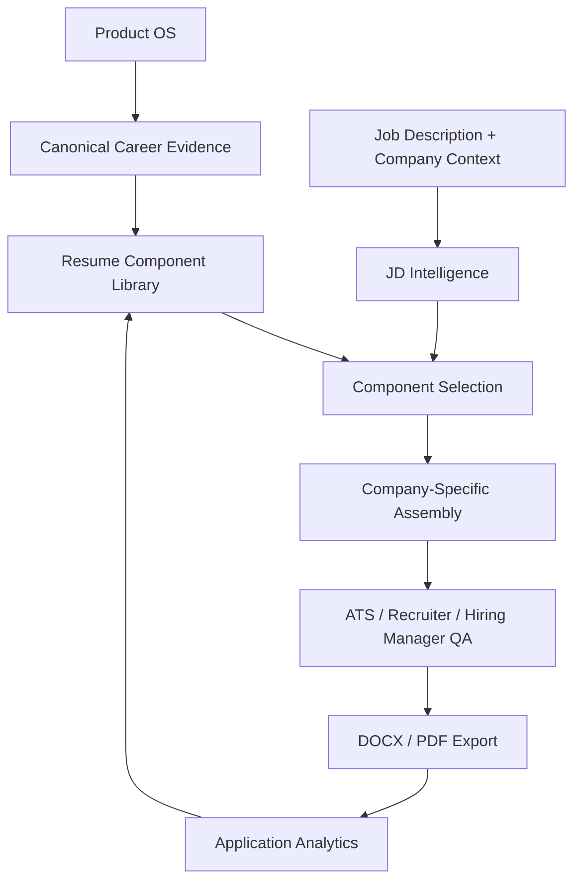

# Resume Architecture

## Executive Summary

Resume OS is an information architecture that converts canonical Product OS evidence into tailored resume versions through structured intelligence, component selection, assembly, QA, export, and outcome analytics.

It is designed for one candidate operating a high-quality customized job-search pipeline.

## Logical Architecture

## Architecture Principle

Product OS stores proof. Resume OS routes proof to the right hiring context.

## Layer A: Canonical Evidence Layer

Purpose: protect factual integrity.

Includes:

- Identity
- Career history
- Dates
- Titles
- Companies
- Verified metrics
- Team scope
- Technologies
- Awards
- Education
- Certifications
- Publications
- Product OS assets

Rules:

- This layer is not tailored per company.
- Fields such as dates, titles, companies, and metrics must never be inferred.
- Updates require evidence review before reuse in resume components.

## Layer B: Component Layer

Purpose: convert canonical facts into reusable resume modules.

Includes:

- Headlines
- Summary modules
- Experience bullets
- Project modules
- Skills modules
- Product OS references
- Education and credential blocks

Rules:

- Components can have approved variants.
- Every variant must map to canonical evidence.
- Components should have maximum length, archetype tags, and evidence references.

## Layer C: Intelligence Layer

Purpose: understand the role before selecting content.

Includes:

- JD parsing
- PM archetype classification
- Competency extraction
- Keyword extraction
- Hidden hiring signals
- Company-context analysis
- Evidence matching
- Gap analysis

Rules:

- Resume OS should identify one primary archetype and up to two secondary archetypes.
- Intelligence can recommend content but cannot invent evidence.
- Hidden signals should be reviewed by a human before use.

## Layer D: Assembly Layer

Purpose: produce a coherent two-page resume.

Includes:

- Section selection
- Bullet ranking
- Word-count control
- Page-length control
- Keyword coverage
- Link placement
- Project placement

Rules:

- Assembly must prioritize relevance over completeness.
- Two pages is the default maximum.
- Company-specific project and flagship Product OS block should not both be included by default.

## Layer E: QA Layer

Purpose: prevent broken, inflated, or low-performing resumes.

Includes:

- Factual verification
- ATS review
- Recruiter scan
- Hiring manager relevance
- AI-written-language review
- Formatting review
- Link verification
- Interview defensibility

Rules:

- Human review is mandatory before submission.
- Any unsupported claim is a P0 issue.
- Broken links are a P0 issue before submission.

## Layer F: Analytics Layer

Purpose: improve future resume selection using outcome evidence.

Includes:

- Resume version
- Application
- Response
- Recruiter screen
- Interview
- Offer
- Conversion by role type
- Conversion by resume components

Rules:

- Analytics should guide iteration, not overfit small samples.
- Do not infer causality from one or two applications.
- Outcome data should feed component quality reviews.

## Data Flow

| Step | Input | Output |
| --- | --- | --- |
| Capture role | JD and company context | Normalized role record |
| Classify role | Requirements and responsibilities | Primary and secondary archetypes |
| Match evidence | Archetypes and competencies | Ranked component candidates |
| Assemble resume | Selected components | Two-page DOCX draft |
| QA resume | Draft resume and source evidence | Reviewed final candidate |
| Export | Approved resume | DOCX and PDF |
| Track outcome | Application activity | Resume performance record |

## Maintainability Rules

- Keep canonical evidence separate from resume variants.
- Keep generation rules separate from resume content.
- Keep analytics separate from application truth.
- Keep Product OS URLs canonical.
- Keep every resume version traceable.
