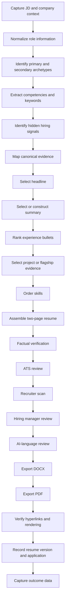

# Resume Workflow

## Executive Summary

Resume OS turns a job description and company context into a tailored, reviewed resume through a repeatable workflow.

Target SLA:

- Standard tailoring: 20 to 30 minutes
- Complex company-specific project resume: 45 to 90 minutes
- Minor update from an existing company variant: under 15 minutes

## Workflow Diagram

## Step 1: Capture JD and Company Context

Inputs:

- Job description
- Company name
- Role title
- Location
- Recruiter notes
- Referral context
- Company product/business model

Output: raw JobDescription record.

## Step 2: Normalize Role Information

Normalize:

- Company name
- Role level
- Role location
- Remote/hybrid requirements
- Product domain
- Hiring team

Do not infer facts such as work authorization, relocation status, or compensation requirements.

## Step 3: Identify Archetypes

Select:

- One primary archetype
- Up to two secondary archetypes

Output: archetype profile.

## Step 4: Extract Competencies and Keywords

Extract:

- Required competencies
- Preferred competencies
- Product domain terms
- Tool or technical terms
- Leadership requirements
- Metrics language

Review for natural use. Do not stuff keywords.

## Step 5: Identify Hidden Hiring Signals

Examples:

- "Ambiguous environments" may signal need for operating-model evidence.
- "Partner with engineering" may signal technical credibility.
- "Executive communication" may signal decision memo or PLB evidence.
- "AI-enabled workflows" may signal AI lifecycle and trust evidence.

Hidden signals are recommendations, not facts.

## Step 6: Map Canonical Evidence

Map the JD to:

- Achievements
- Bullet variants
- Product Leadership Briefs
- GitHub artifacts
- Company-specific projects
- Product OS decision systems

## Step 7: Select Headline

Choose a headline that matches:

- Primary archetype
- Seniority
- Domain
- Differentiator

## Step 8: Select or Construct Summary

Use a SummaryModule:

- 70 to 90 words maximum
- Role-specific
- Evidence-backed
- Optional one-sentence Product OS reference

## Step 9: Rank Experience Bullets

Rank by:

- JD relevance
- Metric strength
- Seniority signal
- Domain match
- Technical credibility
- Leadership signal
- Recency

## Step 10: Select Project or Flagship Evidence

Default rule:

- Use either a company-specific project or a flagship Product OS block.
- Do not use both unless strongly justified by the role.

## Step 11: Order Skills

Order by:

- Primary archetype
- JD keyword relevance
- Actual evidence strength
- Interview defensibility

## Step 12: Assemble Two-Page Resume

Constraints:

- Two pages maximum by default.
- Standard ATS-friendly headings.
- No dense visual layouts.
- Clear chronology.
- Minimal links.

## Steps 13-17: QA Reviews

| Review | Purpose |
| --- | --- |
| Factual verification | Confirm every claim maps to evidence |
| ATS review | Confirm parseability and keyword coverage |
| Recruiter scan | Confirm 10 to 15 second clarity |
| Hiring manager review | Confirm depth and role fit |
| AI-language review | Remove generic AI-sounding phrasing |

## Steps 18-20: Export and Rendering

Export:

- DOCX
- PDF

Verify:

- Page length
- Hyperlinks
- PDF rendering
- ATS-safe layout
- File naming

## Steps 21-22: Version and Outcome Tracking

Record:

- Resume ID
- Company
- Role
- Date
- Components used
- QA scores
- Application status
- Outcome

## SLA Targets

| Scenario | Target Time |
| --- | --- |
| Standard tailoring | 20 to 30 minutes |
| Complex company-specific project resume | 45 to 90 minutes |
| Minor update from existing variant | Under 15 minutes |

## Workflow Controls

- Stop if canonical evidence is missing.
- Stop if the resume exceeds two pages without approval.
- Stop if any unsupported claim remains.
- Stop if links fail.
- Stop if the company-specific project could be mistaken for employment history.
